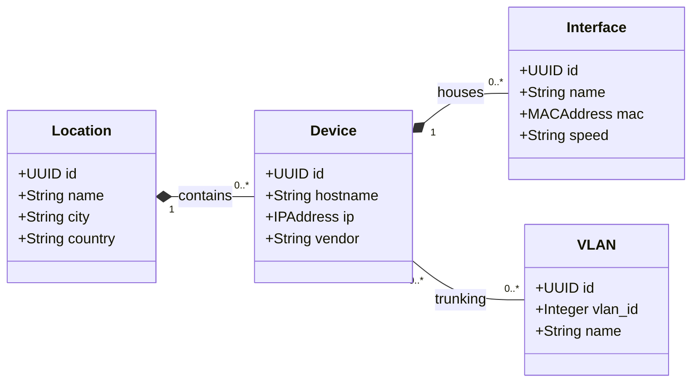

# Enterprise Network Inventory API

> **A High-Performance, Production-Grade REST API for Network Asset Management**


---

## Table of Contents

- [Executive Summary](#executive-summary)
- [System Model & Architecture](#system-model--architecture)
- [Key Features](#key-features)
- [Technology Stack](#technology-stack)
- [Getting Started](#getting-started)
- [API Documentation](#api-documentation)
    - [Devices](#devices)
    - [Interfaces](#interfaces)
    - [Locations](#locations)
    - [VLANs](#vlans)
- [Advanced Usage](#advanced-usage)
    - [Bulk Operations](#bulk-patch-updates)
    - [Filtering & Sorting](#filtering--sorting)
- [Security](#security)
- [Contributing](#contributing)
- [License](#license)

---

## Executive Summary

This project creates a scalable back-end infrastructure for managing complex network inventories. Designed with **Golang**, it prioritizes **low latency**, **concurrency**, and **maintainability**. It serves as a single source of truth for physical assets (Locations), network devices (Switches/Routers), and logical configurations (VLANs/Interfaces).

Ideally suited for:
- **ISPs & Telecoms**: Tracking thousands of devices.
- **Enterprise IT**: Managing campus networks.
- **Data Centers**: Automating infrastructure documentation.

---

## System Model & Architecture

The following diagram illustrates the **Layered Architecture** of the system, demonstrating the separation of concerns between presentation, application logic, and data persistence layers.


### Domain Entity Relationship Model

The formal relationship between managed network entities adheres to the following Third Normal Form (3NF) schema:



---

## Key Features

*   **Blazing Fast**: Native implementation in Go without heavy frameworks.
*   **Secure by Design**:
    *   **TLS 1.2+ Enforcement**: No insecure connections.
    *   **Rate Limiting**: IP-based throttling to prevent abuse.
    *   **Security Headers**: Protecting against XSS, Clickjacking, and Sniffing.
*   **Docker Native**: Ready to deploy with a single command via Docker Compose.
*   **Advanced Filtering**: Granular search capabilities on every resource.
*   **Bulk Operations**: Update thousands of records in a single transactional request.
*   **Audit Ready**: Detailed logging of every request's duration and status.

---

## Technology Stack

| Component | Technology | Description |
| :--- | :--- | :--- |
| **Language** | [Go (Golang)](https://go.dev/) | 1.21+ for high concurrency and performance. |
| **Database** | [PostgreSQL](https://www.postgresql.org/) | Relational data integrity and complex queries. |
| **Routing** | [Gorilla Mux](https://github.com/gorilla/mux) | Robust request routing. |
| **Container** | [Docker](https://www.docker.com/) | Standardized deployment environment. |
| **Management** | [PgAdmin 4](https://www.pgadmin.org/) | Web-based database management GUI. |

---

## Getting Started

### Prerequisites

*   **Docker Desktop** (Required)
*   **Make** (Recommended)
*   **Go 1.21+** (Only for local dev without Docker)

### Quick Start (One-Liner)

The project includes a robust `Makefile` for automation. To start the entire stack (Database + API + Admin GUI):

```bash
make start
```

This will:
1.  Spin up Postgres and PgAdmin containers.
2.  Wait for the database to be healthy.
3.  **Automatically run migrations** to create tables.
4.  Start the API server at `https://localhost:3000`.

### Other Commands

```bash
make build       # Compile the binary to /bin
make run         # Run locally (requires external DB)
make clean       # Remove build artifacts
make up          # Start Docker containers only
make down        # Stop all containers
make gen-certs   # Generate new SSL certificates
```

---

## API Documentation

### Devices

Core network elements (Routers, Switches, Firewalls).

#### `GET /devices`
Retrieve a list of devices.

**Response:**
```json
{
  "status": "success",
  "count": 2,
  "data": [
    {
      "id": "550e8400-e29b-41d4-a716-446655440000",
      "hostname": "ank-core-01",
      "ip": "10.1.1.1",
      "vendor": "Cisco",
      "model": "Catalyst 9500",
      "status": "online",
      "location_id": "a1b2c3d4-e5f6-7890-1234-567890abcdef"
    },
    {
      "id": "770e8400-e29b-41d4-a716-446655440022",
      "hostname": "ist-edge-02",
      "ip": "10.2.1.1",
      "vendor": "Juniper",
      "model": "MX480",
      "status": "maintenance"
    }
  ]
}
```

#### `POST /devices`
Onboard a new device.

**Request:**
```json
{
  "hostname": "brs-access-01",
  "ip": "192.168.20.5",
  "model": "Aruba 2930F",
  "vendor": "Aruba",
  "os": "ArubaOS-Switch",
  "serial_number": "CN12345678",
  "status": "active",
  "rack_position": "Rack 2, U15",
  "location_id": "UUID_OF_LOCATION"
}
```

---

### Interfaces

Physical and logical ports on devices.

#### `GET /interfaces`
Global list of all interfaces.

#### `POST /interfaces`
Add an interface to a device.

**Request:**
```json
{
  "device_id": "550e8400-e29b-41d4-a716-446655440000",
  "name": "TenGigabitEthernet1/1/1",
  "description": "Uplink to Core",
  "type": "fiber",
  "speed": "10000",
  "mac_address": "00:50:56:AB:CD:EF",
  "status": "up"
}
```

---

### Locations

Physical sites (Data Centers, Branch Offices).

#### `POST /locations`
Define a new site.

**Request:**
```json
{
  "name": "Istanbul Data Center",
  "city": "Istanbul",
  "country": "Turkey",
  "address": "Levent Mah. Buyukdere Cad. No:1"
}
```

---

### VLANs

Logical network segmentation.

#### `POST /vlans`
Define a VLAN globally.

**Request:**
```json
{
  "vlan_id": 100,
  "name": "Users_Voice",
  "description": "Voice over IP Network for Staff"
}
```

---

## Advanced Usage

### Bulk Patch Updates

Update thousands of resources in a single atomic transaction. One failure executes a **Rollback** for data consistency.

**Endpoint:** `PATCH /devices` (or `/interfaces`, `/locations`, `/vlans`)

**Request (Update Multiple Devices Status):**
```json
[
  {
    "id": "550e8400-e29b-41d4-a716-446655440000",
    "status": "maintenance"
  },
  {
    "id": "770e8400-e29b-41d4-a716-446655440022",
    "status": "maintenance",
    "notes": "Scheduled Upgrade"
  }
]
```

### Filtering & Sorting

Combine powerful filters with sorting to find exactly what you need.

```bash
# Find all active Cisco devices in Istanbul, sorted by hostname
GET /devices?vendor=Cisco&status=online&city=Istanbul&sortby=hostname:asc

# Find all 10G interfaces that are currently down
GET /interfaces?speed=10000&status=down
```

---

## Security

This project implements industry-standard security practices:

1.  **Strict Transport Security**: All connections are TLS 1.2+ encrypted.
2.  **Rate Limiting**: `60 requests / minute` per IP (Default).
3.  **XSS Protection**: `X-XSS-Protection: 1; mode=block`.
4.  **No Sniff**: `X-Content-Type-Options: nosniff`.
5.  **Frame Options**: `X-Frame-Options: DENY`.
6.  **SQL Injection Prevention**: All queries use **Parameterized Queries ($1, $2)**.

---

## Contributing

We welcome contributions! Please follow the standard "Fork & Pull Request" workflow.

1.  Fork the repository.
2.  Create your feature branch (`git checkout -b feature/AmazingFeature`).
3.  Commit your changes (`git commit -m 'Add some AmazingFeature'`).
4.  Push to the branch (`git push origin feature/AmazingFeature`).
5.  Open a Pull Request.

---

## License

Distributed under the MIT License. See `LICENSE` for more information.

---

<br>
<div align="center">
  
</div>
