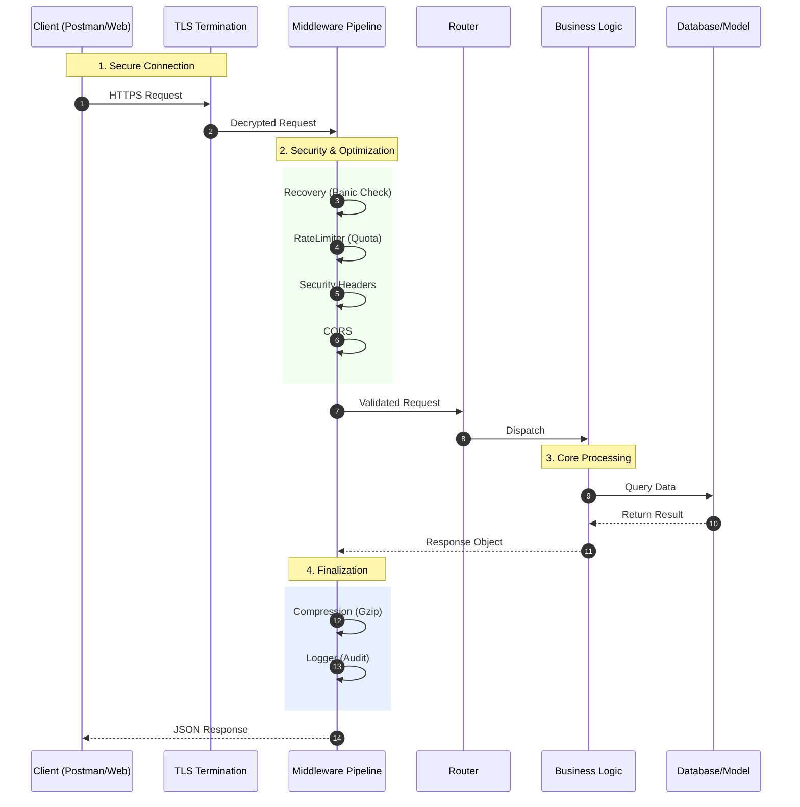

# Enterprise REST API Framework

## Project Overview
This project serves as a robust, production-ready backend framework designed for high-performance applications. Built with **Go** (Golang), it illustrates a scalable architecture capable of managing complex data relationships and handling high concurrency.

The system is engineered for **transparency**, **security**, and **observability**, providing a solid reference implementation for database-driven applications.

## Key Features
- **High Performance**: Native Go implementation for low latency.
- **Security First**: Comprehensive middleware pipeline including Headers, CORS, and Parameter Pollution protection.
- **Observability**: Built-in request logging and response time tracking.
- **Scalable Architecture**: Modular design separating Handlers, Models, and Repositories.
- **Database Ready**: Structure prepared for SQL/NoSQL integration.

## Request Lifecycle

The following diagram visualizes the path a request takes from a client through our security and processing layers before reaching the core logic.



## Middleware Architecture

This API employs a sophisticated chain of middlewares to ensure stability, security, and observability. Every request passes through this pipeline.

| Middleware | Role | Description |
| :--- | :--- | :--- |
| **Recovery** | Stability | Catches unexpected panics to prevent server crashes, returning `500 Internal Server Error`. |
| **Rate Limiter** | Protection | Prevents abuse by limiting requests per IP address. |
| **HPP** | Security | **HTTP Parameter Pollution**. Cleans duplicate query parameters to prevent injection attacks. |
| **Security Headers** | Security | Enforces `X-XSS-Protection`, `X-Frame-Options`, and `Content-Security-Policy`. |
| **CORS** | Access Control | Controls which domains can access the API resources. |
| **Response Time** | Observability | Injects `X-Response-Time` header to track processing duration. |
| **Logger** | Audit | structured logging of Method, Path, Status, and Duration. |
| **Compression** | Optimization | Gzip compression for efficient data transfer. |

## Getting Started

### Prerequisites
*   **Go**: v1.22+
*   **Postman**: For testing API endpoints.

### Installation

1.  **Build the Project:**
    ```bash
    go build -o bin/api.exe ./cmd/api
    ```

2.  **Run the Server:**
    ```bash
    ./bin/api.exe
    # Server starts on https://localhost:3000
    ```

### API Endpoints (Examples)

The project includes example resources (`Devices`, `Interfaces`) to demonstrate CRUD operations. You can replace these with your own domain models (e.g., Users, Products, Orders).

**Health Check**
*   `GET /` - generic health check.

**Example Resource: Devices**
*   `GET /devices` - List all items.
*   `POST /devices` - Create a new item.
*   `GET /devices/{id}` - Get detailed view.
*   `PUT /devices/{id}` - Update item.
*   `DELETE /devices/{id}` - Remove item.