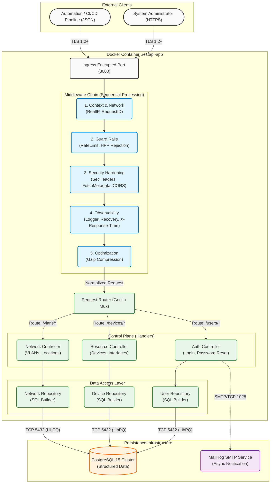

# Enterprise Network Inventory API

> **A High-Performance, Production-Grade REST API for Network Asset Management**


---

## Table of Contents

- [Executive Summary](#executive-summary)
- [System Model & Architecture](#system-model--architecture)
- [Key Features](#key-features)
- [Technology Stack](#technology-stack)
- [Getting Started](#getting-started)
- [Quick Reference](#quick-reference)
- [Postman API Guide](#postman-api-guide)
- [Tutorial: Full Lifecycle](#tutorial-full-entity-lifecycle-step-by-step)
- [Security & Validation](#security--validation)
- [Postman Pro Tips](#postman-pro-automation--scripting)
- [Contributing](#contributing)
- [License](#license)

---

## Executive Summary

This project creates a scalable back-end infrastructure for managing complex network inventories. Designed with **Golang**, it prioritizes **low latency**, **concurrency**, and **maintainability**. It serves as a single source of truth for physical assets (Locations), network devices (Switches/Routers), and logical configurations (VLANs/Interfaces).

Ideally suited for:
- **ISPs & Telecoms**: Tracking thousands of devices.
- **Enterprise IT**: Managing campus networks.
- **Data Centers**: Automating infrastructure documentation.

---

## System Model & Architecture

The following diagram illustrates the **Layered Architecture** of the system, demonstrating the separation of concerns between presentation, application logic, and data persistence layers.



---

## Key Features

*   **Blazing Fast**: Native implementation in Go without heavy frameworks.
*   **Secure by Design**:
    *   **TLS 1.2+ Enforcement**: No insecure connections. All endpoints are HTTPS.
    *   **Modern Auth**: JWT-ready structure with Argon2id password hashing.
    *   **Rate Limiting**: IP-based throttling to prevent abuse.
    *   **Security Headers**: Protecting against XSS, Clickjacking, and Sniffing.
*   **Docker Native**: Ready to deploy with a single command via Docker Compose.
*   **Massive Scalability**: Tested with generated datasets of 1000+ interfaces.
*   **Advanced Filtering**: Granular search capabilities on every resource.
*   **Standardized API**: Consistent JSON responses and error handling.
*   **Audit Ready**: Detailed logging of every request's duration and status.
*   **Full Observability**: Integrated **Request ID** tracing and **Real IP** resolution.
*   **RFC Compliance**: Strictly standardized JSON error responses (RFC 8259).
*   **Pagination**: Efficient data retrieval with `page` and `limit` parameters for all list endpoints.
*   **Compression**: **Gzip** support for efficient bandwidth usage.
*   **HPP Protection**: Prevents HTTP Parameter Pollution attacks with strict validation.
*   **Precision Timing**: Ends every response with a microsecond-precision `X-Response-Time` header.

---

## Pagination

All list endpoints (`GET /devices`, `GET /users`, etc.) support pagination to handle large datasets efficiently.

### Request Parameters

| Parameter | Type | Default | Description |
| :--- | :--- | :--- | :--- |
| `page` | `int` | `1` | The page number to retrieve. |
| `limit` | `int` | `10` | The number of items per page (Max: 100). |

**Example:**
`GET https://localhost:3000/devices?page=2&limit=5`

### Response Structure

The response for list endpoints is wrapped in a standard structure containing metadata and the data array.

```json
{
  "meta": {
    "current_page": 2,
    "limit": 5,
    "total_pages": 4,
    "total_count": 20
  },
  "data": [
    { ... },
    { ... }
  ]
}
```

## Technology Stack

| Component | Technology | Description |
| :--- | :--- | :--- |
| **Language** | [Go (Golang)](https://go.dev/) | 1.21+ for high concurrency and performance. |
| **Database** | [PostgreSQL](https://www.postgresql.org/) | Relational data integrity (UUIDs, Foreign Keys). |
| **Routing** | [Gorilla Mux](https://github.com/gorilla/mux) | Robust request routing. |
| **Container** | [Docker](https://www.docker.com/) | Standardized deployment environment. |
| **Management** | [PgAdmin 4](https://www.pgadmin.org/) | Web-based database management GUI. |

---

## Getting Started

### Prerequisites

*   **Docker Desktop** (Required)
*   **Make** (Recommended for automation)
*   **Go 1.21+** (Only for local dev without Docker)
*   **cURL** or **Postman** (For testing)

### Quick Start (One-Liner)

The project includes a robust `Makefile` for automation. To start the entire stack (Database + API + Admin GUI) and populate it with seed data:

```bash
make start
```

This will:
1.  Spin up Postgres and PgAdmin containers.
2.  Wait for the database to be healthy.
3.  **Automatically run migrations** (`init.sql`) to create tables.
4.  **Seed the database** (`seed.sql`) with massive data sets (Locations, Devices, Interfaces).
5.  Start the API server at `https://localhost:3000`.

### Other Commands

```bash
make build       # Compile the binary to /bin
make run         # Run locally (requires external DB)
make clean       # Remove build artifacts
make up          # Start Docker containers only
make down        # Stop all containers
make reset_db    # The "Nuclear Option": Wipes DB volume and re-seeds data
make gen-certs   # Generate new SSL certificates
```

### Automation & Makefile (Pro Level)

The project includes a robust `Makefile` for advanced automation. Here is how to use it like a pro:

| Command | Description |
| :--- | :--- |
| **`make up`** | **Start Everything:** Clean start of API + DB + MailHog + PgAdmin in background. |
| **`make down`** | **Stop Everything:** Stops all containers and removes networks (safe shutdown). |
| **`make restart`**| **Reboot:** Sequentially runs `down` then `up`. Useful for quick resets. |
| **`make logs`** | **Live Logs:** tails the logs of all services in real-time. |
| **`make shell`** | **Terminal Access:** Opens a shell *inside* the running API container for debugging. |
| **`make build`** | **Compile:** Builds the Go binary locally to `/bin` (no Docker required). |
| **`make run`** | **Dev Mode:** Runs `go run main.go` locally (requires local Postgres). |
| **`make test`** | **Test Suite:** Runs all unit/integration tests with verbose output. |
| **`make fmt`** | **Code Style:** Formats all Go files using standard `go fmt`. |
| **`make vet`** | **Linting:** Runs static analysis to find potential bugs (`go vet`). |
| **`make tidy`** | **Dependencies:** Cleans up `go.mod` (removes unused libs, adds missing ones). |
| **`make docker-build`**| **Force Build:** Re-builds the Docker image from scratch (pulls latest Alpine/Go). |
| **`make reset_db`** | **The "Nuclear" Option:** :warning: Destroys the DB volume and re-seeds data. |
| **`make gen-certs`**| **SSL/TLS:** Generates fresh self-signed certificates for local HTTPS. |

---

## Execution Modes (Choose Your Path)

We provide three distinct ways to run this application, depending on your needs:

### 1. Docker Mode (Recommended)
**Best for:** Production simulation, ease of use, zero dependency hell.
*   **How:** `make up`
*   **Why:** Runs everything (Postgres, MailHog, PgAdmin, API) in isolated containers. No local Go or Postgres installation required.
*   **Access:** API at `https://localhost:3000` (Mapped from container port 3000).

### 2. Local Development Mode
**Best for:** Rapid coding, debugging, and testing changes instantly.
*   **Prerequisite:** You need a local PostgreSQL instance running or use `docker-compose up postgres -d`.
*   **How:** `make run` (or `go run cmd/api/main.go`)
*   **Why:** Fastest feedback loop. Uses your machine's resources directly.

### 3. Binary / Production Mode
**Best for:** High-performance deployment on bare metal.
*   **How:**
    1.  `make build` (Generates `bin/api.exe` or `bin/api`)
    2.  `./bin/api.exe`
*   **Why:** Runs the optimized, compiled binary. This is how the app runs in real production environments.

---

## Quick Reference

*   **Base URL:** `https://localhost:3000`
*   **TLS/SSL:** Self-signed certificates (use `-k` in curl or disable verification in Postman).
*   **Admin Credentials:**
    *   **Username:** `admin`
    *   **Password:** `admin123`
*   **ID Format:** Standard **UUIDs** (e.g., `550e8400-e29b-41d4-a716-446655440000`).

---

## Postman API Guide

### 1. Authentication & Session
**Login** (Obtain Token & Cookie)
```http
POST /users/login
Content-Type: application/json

{
  "username": "admin",
  "password": "admin123"
}
```

**Logout** (Clear Session)
```http
POST /users/logout
```

---

### 2. User Management
**Update Password**
```http
PUT /users/{UUID}/password
Authorization: Bearer <token>
Content-Type: application/json

{
  "new_password": "secure_pass_123"
}
```

**Forgot Password**
```http
POST /users/forgot-password
Content-Type: application/json

{
  "email": "admin@example.com"
}
```

---

### 3. Device Inventory
**List All Devices**
```http
GET /devices
```

**Filter by Vendor & Status**
```http
GET /devices?vendor=Cisco&status=active
```

**Advanced Sort (Multi-Field)**
```http
GET /devices?sortby=vendor:asc&sortby=hostname:desc
```

**Create New Device**
```http
POST /devices
Content-Type: application/json

{
  "hostname": "nyc-core-01",
  "ip": "10.0.0.1",
  "model": "ASR 9000",
  "vendor": "Cisco",
  "os": "IOS-XR",
  "status": "active",
  "location_id": "uuid-goes-here"
}
```

**Bulk Delete Devices**
```http
DELETE /devices
Authorization: Bearer <token>
Content-Type: application/json

["uuid-1", "uuid-2", "uuid-3"]
```

#### Query Parameter Reference (Devices)
| Parameter | Description | Example |
| :--- | :--- | :--- |
| `hostname` | Exact match | `?hostname=core-router-01` |
| `ip` | Exact IP match | `?ip=10.20.30.40` |
| `vendor` | Manufacturer | `?vendor=Cisco` |
| `model` | Hardware model | `?model=ASR9000` |
| `os` | Operating System | `?os=IOS-XR` |
| `os_version` | OS Version string | `?os_version=7.4.1` |
| `status` | Lifecycle status | `?status=active` |
| `role` | Functional role | `?role=spine` |
| `serial_number` | Serial Number | `?serial_number=SN12345` |
| `rack_position` | Location details | `?rack_position=Rack-A01` |
| `location_id` | UUID of location | `?location_id={UUID}` |
| `last_seen` | Timestamp | `?last_seen=2024-01-01T00:00:00Z` |

#### Sub-Resources & Utilities
| Requirement | Method | URL Path |
| :--- | :--- | :--- |
| **Get Device Interfaces** | `GET` | `/devices/{id}/interfaces` |
| **Quick Interface Count** | `GET` | `/devices/{id}/interfacecount` |
| **Partial Update (Bulk)** | `PATCH` | `/devices` (Batch Array) |

---

### 4. Interface Management
**Find High-Speed Links**
```http
GET /interfaces?speed=100Gbps&status=up
```

**Search Optical Links**
```http
GET /interfaces?type=fiber&sortby=name:asc
```

**Bulk Update (Shutdown)**
```http
PATCH /interfaces
Content-Type: application/json

[
  { "id": "uuid-1", "status": "down" },
  { "id": "uuid-2", "status": "down" }
]
```

**Bulk Delete Interfaces**
```http
DELETE /interfaces
Authorization: Bearer <token>
Content-Type: application/json

["uuid-1", "uuid-2"]
```

#### Query Parameter Reference (Interfaces)
| Parameter | Description | Example |
| :--- | :--- | :--- |
| `name` | Interface name | `?name=Eth1/1` |
| `type` | Media type | `?type=fiber` |
| `status` | Link status | `?status=up` |
| `admin_status` | Configured status | `?admin_status=up` |
| `oper_status` | Protocol status | `?oper_status=down` |
| `speed` | Human-readable speed | `?speed=10Gbps` |
| `speed_mbps` | Speed in Mbps (Int) | `?speed_mbps=10000` |
| `mtu` | Packet size | `?mtu=9000` |
| `mac_address` | Hardware address | `?mac_address=00:aa:bb...` |
| `mode` | L2/L3 Mode | `?mode=trunk` |
| `ifindex` | SNMP Index | `?ifindex=101` |
| `device_id` | Parent Device UUID | `?device_id={UUID}` |
| `ip_address` | Assigned IP | `?ip_address=192.168.1.1` |

#### Sub-Resources & Utilities
| Requirement | Method | URL Path |
| :--- | :--- | :--- |
| **Batch Status Update** | `PATCH` | `/interfaces` (Bulk Patch) |

---

### 5. Site & Location Management
**List Locations by Country**
```http
GET /locations?country=Turkey
```

**Register New Site**
```http
POST /locations
Content-Type: application/json

{
  "name": "Istanbul DC",
  "city": "Istanbul",
  "country": "Turkey",
  "address": "Maslak 1453"
}
```

#### Sub-Resources & Utilities
| Requirement | Method | URL Path |
| :--- | :--- | :--- |
| **Get Site Inventory** | `GET` | `/locations/{id}/devices` |
| **Quick Device Count** | `GET` | `/locations/{id}/devicescount` |
| **Batch Update Sites** | `PATCH` | `/locations` (Bulk Patch) |
| **Batch Remove Sites** | `DELETE` | `/locations` (Array of IDs) |

---

### 6. Logical Assets (VLANs)
**Filter by VLAN ID**
```http
GET /vlans?vlan_id=100
```

**Search by Name**
```http
GET /vlans?name=Voice&status=active
```

**Create VLAN**
```http
POST /vlans
Content-Type: application/json

{
  "vlan_id": 20,
  "name": "VoIP-Users",
  "description": "Voice over IP Segment"
}
```

#### Sub-Resources & Utilities
| Requirement | Method | URL Path |
| :--- | :--- | :--- |
| **Batch Update VLANs** | `PATCH` | `/vlans` (Bulk Patch) |
| **Batch Remove VLANs** | `DELETE` | `/vlans` (Array of IDs) |

---

### 7. Enterprise Features & Topology

**Topology Management (Links)**
Full CRUD support for physical link management between interfaces.

*   **List All Links**: `GET /links`
*   **Create Link**: 
    ```http
    POST /links
    Content-Type: application/json
    {
      "a_interface_id": "{UUID}",
      "b_interface_id": "{UUID}",
      "type": "fiber",
      "status": "up"
    }
    ```
*   **Update Link**: `PUT /links/{id}`
*   **Delete Link**: `DELETE /links/{id}`

**System Events**
*   **List Events**: `GET /events`
*   **Create Event (System/Webhooks)**:
    ```http
    POST /events
    Content-Type: application/json
    {
      "severity": "critical",
      "type": "security",
      "message": "Unauthorized access attempt detected",
      "device_id": "{OPTIONAL_UUID}"
    }
    ```

**Performance Metrics**
*   **System Overview**: `GET /metrics`
*   **Device Specific**: `GET /metrics/device/{id}`

**Utilities & Debug**
*   **Debug Location Count**: `GET /debug/count`

---

### 8. Advanced Usage & Edge Cases

#### **A. System Health Check**
Verifies that the API server is reachable.
```http
GET /
```
*Response: "Running API v1"*

#### **B. Pagination in Action**
Fetch page 2 with 5 items per page.
```http
GET /devices?page=2&limit=5
```

#### **C. Error Handling Scenarios**

**401 Unauthorized** (Missing Token)
```http
GET /users
```
*Response:*
```json
{ "status": "error", "message": "Missing Authorization header" }
```

**404 Not Found** (Invalid UUID)
```http
GET /devices/00000000-0000-0000-0000-000000000000
```
*Response:*
```json
{ "status": "error", "message": "Device not found" }
```

### Standard Error Format
All errors follow a unified JSON structure for easy parsing by frontend clients:
```json
{
  "status": "error",
  "message": "Human readable reason for failure"
}
```
| Status Code | Meaning |
| :--- | :--- |
| **400** | **Bad Request**: Validation failed or missing fields. |
| **401** | **Unauthorized**: Invalid or missing JWT/Cookie. |
| **403** | **Forbidden**: RBAC restriction or cross-site attack. |
| **404** | **Not Found**: Resource does not exist. |
| **429** | **Too Many Requests**: Rate limit exceeded. |
| **500** | **Server Error**: Database or internal logic failure. |

---

**400 Bad Request** (Validation Failure)
```http
POST /devices
Content-Type: application/json

{ "ip": "999.999.999.999" }
```
*Response:*
```json
{ "status": "error", "message": "Invalid IP address format" }
```

**403 Forbidden** (Insufficent Permissions)
```http
DELETE /locations/uuid
```
*Response:*
```json
{ "status": "error", "message": "Permission denied" }
```

**409 Conflict** (Duplicate Resource)
```http
POST /users
```
*Response:*
```json
{ "status": "error", "message": "Email already exists" }
```

**429 Too Many Requests** (Rate Limit Exceeded)
*Response (includes Retry-After header):*
```json
{ "status": "error", "message": "Too many requests" }
```

**500 Internal Server Error** (Unexpected Failure)
*Response:*
```json
{ "status": "error", "message": "Internal Server Error" }
```

#### **D. Security & HPP (HTTP Parameter Pollution)**

**HPP Blocking (Default)**
Trying to confuse the server with duplicate parameters.
```http
GET /devices?page=1&page=500
```
*Response:*
```json
{ "status": "error", "message": "Duplicate query parameter forbidden: page" }
```

**HPP Allowed List (e.g. Sorting)**
Specific parameters like `sortby` are whitelisted for multi-value usage.
```http
GET /devices?sortby=model:asc&sortby=vendor:desc
```
*Response: Returns devices sorted first by model, then by vendor.*

#### **E. Data Center Asset Tracking**

**Locate by Serial Number**
```http
GET /devices?serial_number=SN-99887766
```

**Find Devices in Specific Rack**
```http
GET /devices?rack_position=Rack-42-U10
```

**Search Interfaces by MAC Address**
Trace the physical location of a connected client.
```http
GET /interfaces?mac_address=00:1A:2B:3C:4D:5E
```

---

### 6. Query Masterclass (Combined Logic)

| Requirement                        | Method | Full Request URL Path                                                                 |
| :--------------------------------- | :----- | :------------------------------------------------------------------------------------ |
| **Simple Listing**                 | `GET`  | `/devices`                                                                            |
| **Get Specific User Settings**     | `GET`  | `/users/{UUID}`                                                                       |
| **Newest Inventory First**         | `GET`  | `/devices?sortby=created_at:desc`                                                    |
| **Backbone Interface Sort**        | `GET`  | `/interfaces?speed=400Gbps&sortby=name:asc`                                           |
| **Down Status (Fiber Only)**       | `GET`  | `/interfaces?type=fiber&status=down&sortby=speed:desc&sortby=name:asc`                |
| **Inactive Accounts Search**       | `GET`  | `/users?inactive_status=true`                                                         |
| **Turkey Hub Multi-Sort**          | `GET`  | `/locations?country=Turkey&sortby=city:asc&sortby=name:desc`                          |
| **FinTech VLANs (High ID First)**  | `GET`  | `/vlans?name=HFT&sortby=vlan_id:desc`                                                 |
| **Bulk Interface Shutdown**        | `PATCH`| `/interfaces` (With JSON Body Array)                                                  |
| **Total Inventory Purge (Nuclear)**| `DEL`  | `/locations/{UUID}` (Cascade delete enabled in DB)                                    |


---

---

## Tutorial: Full Entity Lifecycle (Step-by-Step)

Follow these scenarios to master every method available in the API. Each scenario walks you through a real-world network engineering workflow.

### A. Device Lifecycle (Scenario: ISP Border Router)

> [!TIP]
> This workflow demonstrates how to provision, monitor, and decommission a core network asset.

#### Step 1: Create
**POST (Create)**: Register a new Nokia Service Router.
```http
POST /devices
```
```json
{
  "hostname": "br-ist-core-01", 
  "ip": "100.100.100.1", 
  "model": "7750 SR-1s", 
  "vendor": "Nokia", 
  "os": "SR OS", 
  "status": "active", 
  "location_id": "{LOC_UUID}"
}
```

#### Step 2: Verify
**GET (Verify)**: List all Nokia devices to find your new router.
```http
GET /devices?vendor=Nokia&sortby=hostname:asc
```

#### Step 3: Update (Partial)
**PATCH (Update)**: Set the router to maintenance mode for a firmware upgrade.
```http
PATCH /devices/{UUID}
```
```json
{"status": "maintenance"}
```

#### Step 4: Replace (Full)
**PUT (Full Replace)**: Transition to a new hardware model and IP while keeping the same UUID.
```http
PUT /devices/{UUID}
```
```json
{
  "hostname": "br-ist-core-01-v2", 
  "ip": "100.100.100.2", 
  "model": "7750 SR-12", 
  "vendor": "Nokia", 
  "os": "SR OS v22", 
  "status": "active"
}
```

#### Step 5: Remove
**DELETE (Remove)**: Decommission the legacy router.
```http
DELETE /devices/{UUID}
```

---

### B. Interface Operations (Scenario: 400Gbps Backbone Link)

> [!NOTE]
> Managing physical connectivity at scale using bulk operations and granular filtering.

#### Step 1: Provision
**POST (Provision)**: Create the primary 400G optical port.
```http
POST /interfaces
```
```json
{
  "device_id": "{DEV_UUID}", 
  "name": "400GE1/1/1", 
  "description": "Inter-AS Link", 
  "type": "fiber", 
  "speed": "400Gbps", 
  "status": "up"
}
```

#### Step 2: Audit
**GET (Audit)**: Search for all terabit-scale interfaces.
```http
GET /interfaces?speed=400Gbps&sortby=status:asc
```

#### Step 3: Bulk Action
**PATCH (Bulk)**: Shutdown multiple backbone links for emergency fiber repair.
```http
PATCH /interfaces
```
```json
[
  { "id": "{IF_UUID_1}", "status": "down" }, 
  { "id": "{IF_UUID_2}", "status": "down" }
]
```

#### Step 4: Clean
**DELETE**: Clean up an incorrectly provisioned test port.
```http
DELETE /interfaces/{UUID}
```

---

### C. VLAN Provisioning (Scenario: Low-Latency HFT Segment)

> [!IMPORTANT]
> Logical asset management for high-frequency trading segments.

#### Step 1: Define
**POST**: Define a new ultra-low latency multicast VLAN.
```http
POST /vlans
```
```json
{
  "vlan_id": 105, 
  "name": "NY4-Mcast-Feed", 
  "description": "NYSE Data Feed"
}
```

#### Step 2: Search
**GET**: Verify the VLAN exists and check its sort position.
```http
GET /vlans?sortby=vlan_id:asc&name=NY4
```

#### Step 3: Modify
**PATCH**: Update description to include specific sub-feeds.
```http
PATCH /vlans/{UUID}
```
```json
{"description": "NYSE Data Feed (Equinix NY4 Hub)"}
```

#### Step 4: Retire
**DELETE**: Remove VLAN after the market data session ends.
```http
DELETE /vlans/{UUID}
```

---

## Security & Validation

This project implements industry-standard security practices and strict data validation to ensure network integrity.

### 1. Security Overview
- **Strict Transport Security (HSTS)**: Enforced TLS 1.2+ encryption (`max-age=31536000`).
- **Modern CSRF Protection**: Implements **Fetch Metadata** resource isolation to block cross-site state-changing requests.
- **HPP Protection**: Strict checking for duplicate query parameters (Allow-list based).
- **Smart Rate Limiting**: IP-based sliding window (`100 req/min`) with port stripping and memory cleanup.
- **Cross-Origin Isolation**:
    - `Cross-Origin-Opener-Policy`: same-origin
    - `Cross-Origin-Resource-Policy`: same-origin
    - `Cross-Origin-Embedder-Policy`: require-corp
- **Browser Hardening**:
    - `X-XSS-Protection`: 1; mode=block
    - `X-Content-Type-Options`: nosniff
    - `X-Frame-Options`: DENY (Prevents Clickjacking)
    - `Referrer-Policy`: strict-origin-when-cross-origin
    - `Permissions-Policy`: Camera, Mic, Geolocation disabled.
- **SQL Injection Prevention**: All queries use **Parameterized Queries ($1, $2)**.
- **XSS Protection**: Integrated `bluemonday` sanitization for all JSON and Form-data inputs.
- **RBAC (Role-Based Access Control)**: Granular permission system (Admin vs. User vs. Owner).
- **Bulk Operations**: Batch Patch/Delete support for inventory resources (Devices, Interfaces, Locations, VLANs).

### 2. Role-Based Access Control (RBAC)

The API implements a robust RBAC system to ensure data security. Roles are embedded in the JWT and checked via middleware.

| Role | Access Level | Description |
| :--- | :--- | :--- |
| **Admin** | Full Access | Can create, update, delete, and list all resources. |
| **User** | Read-Only / Limited | Can list resources (Devices, Locations) but cannot modify them. |
| **Owner** | Resource-Specific | Can only update/delete resources they own (e.g., their own user profile). |

> [!IMPORTANT]
> **Owner vs Admin**: If a user is an `admin`, they can modify any resource. If a user is a `user`, they can only modify their own data (e.g., `PUT /users/{MY_UUID}`) if they are the **Owner**.

**Middleware Usage Example:**
```go
// In router.go
adminOnly := middlewares.RequireRole("admin")
protected.Handle("/devices", adminOnly(http.HandlerFunc(handlers.CreateDevice))).Methods("POST")
```

### 3. JSON Sanitization (XSS Protection)

To prevent Cross-Site Scripting (XSS) attacks, the API automatically sanitizes all incoming JSON and Form bodies using the `bluemonday` UGC policy.

- **Strict Mode**: Rejects requests (400 Bad Request) if suspicious HTML/JS is detected.
- **Recursive Cleaning**: Deep-sanitizes nested JSON objects and arrays.
- **Query Param Safety**: Automatically cleans search parameters to prevent injection via URL.

### 4. Generic SQL Query Builder

For developers, the `internal/utils/sql_builder.go` provides a type-safe way to generate dynamic SQL queries.

- **`GenerateInsertQuery`**: Automatically maps Go structs to SQL INSERT statements based on `db` or `json` tags.
- **`BuildUpdateQuery`**: Constructs dynamic UPDATE statements with allowed-field filtering.
- **`GetStructValues`**: Reflectively extracts data from structs for batch operations.

**Developer Example:**
```go
data, _ := utils.GetStructValues(device)
query, args, _ := utils.GenerateInsertQuery("devices", data)
// Result: INSERT INTO devices (hostname, ip...) VALUES ($1, $2...) RETURNING id
```

### 5. Cookie Management
The API uses secure, server-side cookies for session management. When you log in via `/users/login`, the server issues a `Bearer` cookie with:
- **HttpOnly** (No JS access)
- **Secure** (HTTPS only)
- **SameSite=Strict** (CSRF protection)
- **MaxAge=24h**

### 6. Data Validation Examples (Proving Integrity)
These examples demonstrate how the API handles invalid inputs.

- **Invalid IP Format**: `POST {{base_url}}/devices` with `{"ip": "999.999.999.999"}` -> `400 Bad Request`
- **VLAN Range Check**: `POST {{base_url}}/vlans` with `{"vlan_id": 5000}` -> `400 Bad Request`
- **Missing Required Fields**: `POST {{base_url}}/users` with empty fields -> `400 Bad Request`

---

## System Upgrades & Audit (Feb 2026)

A comprehensive security and code quality audit was performed to ensure production readiness.

### 1. Robust Password Hashing
- **Upgrade**: Refactored `Argon2` verification logic to dynamically parse hash parameters (Memory, Time, Threads).
- **Benefit**: Ensures forward compatibility. If security parameters are increased in the future, existing user passwords will remain valid without migration.
- **Verification**: New unit tests added in `pkg/utils/password_test.go`.

### 2. Codebase & API Integrity
- **Backend Audit**: Verified all 50+ API endpoints for consistency between Go handlers (Backend) and JS Client (Frontend).
- **Clean Code**: Removed debug artifacts (`console.log`) from production frontend builds.
- **Stability**: Confirmed zero-warning build status with `go build` and `go vet`.

---

## Authentication Guide

The API utilizes a modern, hybrid **JWT (JSON Web Token)** authentication system designed for both programmatic clients (CLI/Mobile) and Web Browsers.

### 1. The Token & Cookie Concept
We implement a **Dual-Delivery** mechanism for the authentication token:

1.  **The Token (Bearer)**:
    *   **What is it?**: A signed JWT containing the User ID, Username, and Role.
    *   **Use Case**: Mobile Apps, CLIs, Postman, and external scripts.
    *   **How to use**: Send it in the Header: `Authorization: Bearer <your_token>`.

2.  **The Cookie (HttpOnly)**:
    *   **What is it?**: The exact same JWT, stored in a secure, server-side Cookie.
    *   **Use Case**: Web Applications (React, Vue, etc.).
    *   **Security**: The cookie is `HttpOnly` (JavaScript cannot read it), `Secure` (HTTPS only), and `SameSite=Strict` (Prevents CSRF).
    *   **How to use**: The browser automatically handles this. You don't need to do anything manually!

### 2. Login Example
**Request:**
```http
POST /users/login
Content-Type: application/json

{
  "username": "admin",
  "password": "your_secure_password"
}
```

**Response (Success - 200 OK):**
```json
{
  "status": "success",
  "message": "Login successful",
  "token": "eyJhbGciOiJIUzI1NiIsInR5cCI6IkpXVCJ9..."
}
```
*Note: The response also sets the `Bearer` cookie automatically.*

### 3. Logout Example
Terminates the server-side session by invalidating the cookie.

**Request:**
```http
POST /users/logout
```

**Response (Success - 200 OK):**
```json
{
    "status": "success",
    "message": "Logged out"
}
```
*Note: This action clears the `Bearer` cookie by setting its expiration date to the past.*

---

## Postman Pro: Automation & Scripting

Level up your API testing by using Postman's built-in automation features.

### A. Environment Variables
Instead of hardcoding URLs, use environments (the eye icon top-right).
- **Variable**: `base_url` -> `https://localhost:3000`
- **Variable**: `bearer_token` -> (leave empty, will be auto-filled)

### B. Auto-Save Token (Tests Script)
Add this to the **Tests** tab of your `POST /users/login` request. It will automatically save the token for all future requests.

```javascript
// Parse response
const response = pm.response.json();

// Save token to environment if login is successful
if (pm.response.code === 200 && response.token) {
    pm.environment.set("bearer_token", response.token);
    console.log("Token auto-saved to environment!");
}

// Pro-Tip: Add a test to verify status
pm.test("Status code is 200", function () {
    pm.response.to.have.status(200);
});
```

### C. Automated Data Validation
Add these to the **Tests** tab of any `GET` request to ensure the API stays healthy.

```javascript
// 1. Verify response time (Good for HFT testing)
pm.test("Response time is less than 200ms", function () {
    pm.expect(pm.response.responseTime).to.be.below(200);
});

// 2. Check for required fields
pm.test("Response has required fields", function () {
    const jsonData = pm.response.json();
    pm.expect(jsonData).to.be.an('array');
    if (jsonData.length > 0) {
        pm.expect(jsonData[0]).to.have.property('id');
        pm.expect(jsonData[0]).to.have.property('hostname');
    }
});
```

### D. Dynamic Data (Pre-request Script)
Generate random data for stress testing in the **Pre-request Script** tab.

```javascript
// Generate a unique hostname
const randomSuffix = Math.floor(Math.random() * 1000);
pm.variables.set("dynamic_hostname", "rtr-automated-" + randomSuffix);
```
*Now use `{{dynamic_hostname}}` in your POST body!*

---

## Postman Usage Tips
1.  **SSL Verification**: Go to Postman `Settings` > `General` and turn **OFF** `SSL certificate verification` to allow self-signed local certs.
2.  **Auth (Next Step)**: Copy the `token` from the login response. In other requests, go to the `Auth` tab, select `Bearer Token`, and paste it. 
    > [!TIP]
    > If you used the **Auto-Save Token** script above, just type `{{bearer_token}}` in the Token field!
3.  **Collection Variables**: Create a variable called `base_url` with value `https://localhost:3000`. Use `{{base_url}}/devices` to save time.

---

## Contributing

We welcome contributions! Please follow the standard "Fork & Pull Request" workflow.

1.  Fork the repository.
2.  Create your feature branch (`git checkout -b feature/AmazingFeature`).
3.  Commit your changes (`git commit -m 'Add some AmazingFeature'`).
4.  Push to the branch (`git push origin feature/AmazingFeature`).
5.  Open a Pull Request.

---

## License

Distributed under the MIT License. See `LICENSE` for more information.

---

<br>
<div align="center">
  
</div>
