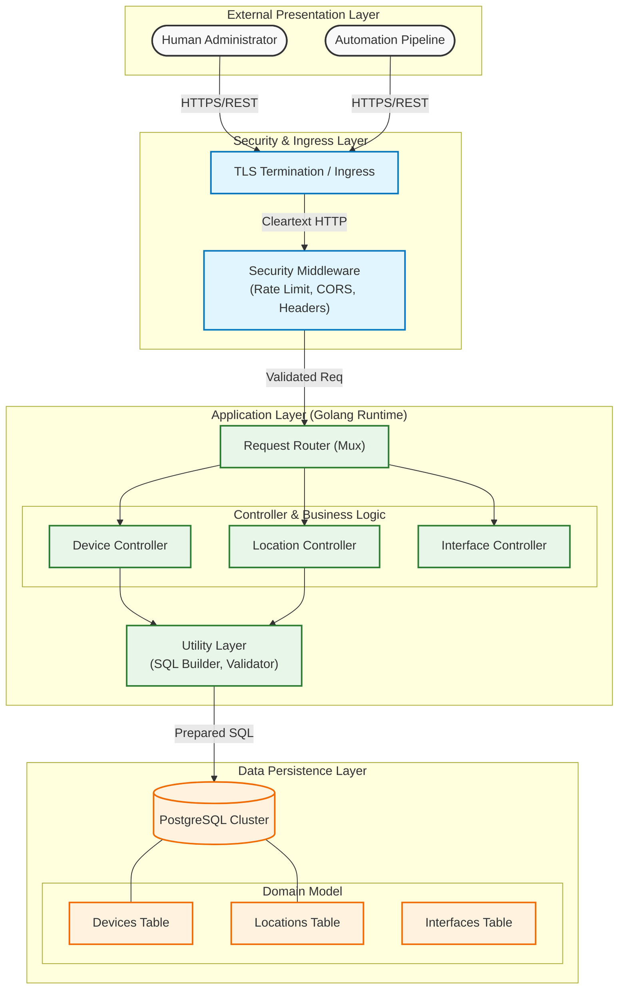
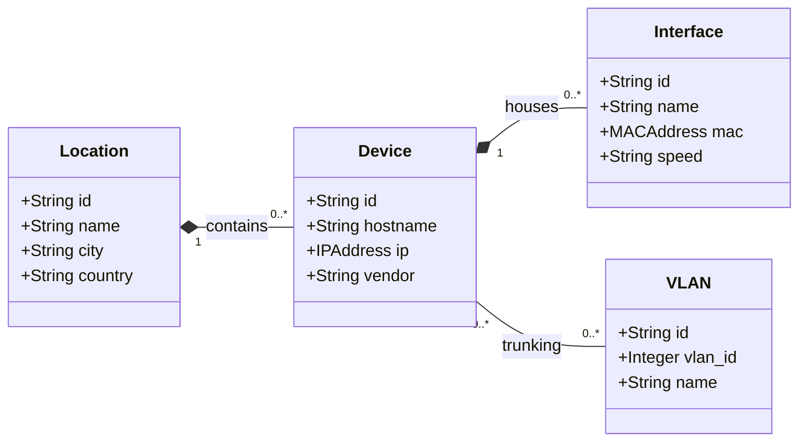

# Enterprise Network Inventory API

> **A High-Performance, Production-Grade REST API for Network Asset Management**


---

## Table of Contents

- [Executive Summary](#executive-summary)
- [System Model & Architecture](#system-model--architecture)
- [Key Features](#key-features)
- [Technology Stack](#technology-stack)
- [Getting Started](#getting-started)
- [API Documentation](#api-documentation)
    - [Devices](#devices)
    - [Interfaces](#interfaces)
    - [Locations](#locations)
    - [VLANs](#vlans)
- [Advanced Usage](#advanced-usage)
    - [Bulk Operations](#bulk-patch-updates)
    - [Filtering & Sorting](#filtering--sorting)
- [Security](#security)
- [Contributing](#contributing)
- [License](#license)

---

## Executive Summary

This project creates a scalable back-end infrastructure for managing complex network inventories. Designed with **Golang**, it prioritizes **low latency**, **concurrency**, and **maintainability**. It serves as a single source of truth for physical assets (Locations), network devices (Switches/Routers), and logical configurations (VLANs/Interfaces).

Ideally suited for:
- **ISPs & Telecoms**: Tracking thousands of devices.
- **Enterprise IT**: Managing campus networks.
- **Data Centers**: Automating infrastructure documentation.

---

## System Model & Architecture

The following diagram illustrates the **Layered Architecture** of the system, demonstrating the separation of concerns between presentation, application logic, and data persistence layers.



### Domain Entity Relationship Model

The formal relationship between managed network entities adheres to the following Third Normal Form (3NF) schema:



---

## Key Features

*   **Blazing Fast**: Native implementation in Go without heavy frameworks.
*   **Secure by Design**:
    *   **TLS 1.2+ Enforcement**: No insecure connections.
    *   **Rate Limiting**: IP-based throttling to prevent abuse.
    *   **Security Headers**: Protecting against XSS, Clickjacking, and Sniffing.
*   **Docker Native**: Ready to deploy with a single command via Docker Compose.
*   **Advanced Filtering**: Granular search capabilities on every resource.
*   **Bulk Operations**: Update thousands of records in a single transactional request.
*   **Audit Ready**: Detailed logging of every request's duration and status.

---

## Technology Stack

| Component | Technology | Description |
| :--- | :--- | :--- |
| **Language** | [Go (Golang)](https://go.dev/) | 1.21+ for high concurrency and performance. |
| **Database** | [PostgreSQL](https://www.postgresql.org/) | Relational data integrity and complex queries. |
| **Routing** | [Gorilla Mux](https://github.com/gorilla/mux) | Robust request routing. |
| **Container** | [Docker](https://www.docker.com/) | Standardized deployment environment. |
| **Management** | [PgAdmin 4](https://www.pgadmin.org/) | Web-based database management GUI. |

---

## Getting Started

### Prerequisites

*   **Docker Desktop** (Required)
*   **Make** (Recommended)
*   **Go 1.21+** (Only for local dev without Docker)

### Quick Start (One-Liner)

The project includes a robust `Makefile` for automation. To start the entire stack (Database + API + Admin GUI):

```bash
make start
```

This will:
1.  Spin up Postgres and PgAdmin containers.
2.  Wait for the database to be healthy.
3.  **Automatically run migrations** to create tables.
4.  Start the API server at `https://localhost:3000`.

### Other Commands

```bash
make build       # Compile the binary to /bin
make run         # Run locally (requires external DB)
make clean       # Remove build artifacts
make up          # Start Docker containers only
make down        # Stop all containers
make gen-certs   # Generate new SSL certificates
```

---

## API Documentation

### Devices

Core network elements (Routers, Switches, Firewalls).

#### `GET /devices`
Retrieve a list of devices.

**Response:**
```json
{
  "status": "success",
  "count": 2,
  "data": [
    {
      "id": "dev-sf-core-01",
      "hostname": "sf-hq-core-01",
      "ip": "10.10.0.1",
      "vendor": "Cisco",
      "model": "NCS 5500",
      "status": "active",
      "location_id": "loc-us-sf-01"
    },
    {
      "id": "dev-ber-ot-core",
      "hostname": "ber-factory-core",
      "ip": "10.20.0.1",
      "vendor": "Cisco",
      "model": "IE-5000",
      "status": "active"
    }
  ]
}
```

#### `POST /devices`
Onboard a new device.

**Request:**
```json
{
  "hostname": "new-access-sw-01",
  "ip": "192.168.100.5",
  "model": "Catalyst 9200",
  "vendor": "Cisco",
  "os": "IOS-XE",
  "serial_number": "FOC12345678",
  "status": "provisioning",
  "rack_position": "Rack 5, U10",
  "location_id": "loc-us-sf-01"
}
```

#### `PATCH /devices/{id}`
Partially update a device (e.g., change status or IP).

**Request:**
```json
{
  "status": "maintenance",
  "ip": "10.10.0.5"
}
```

#### `DELETE /devices/{id}`
Remove a device from inventory.

---

### Interfaces

Physical and logical ports on devices.

#### `GET /interfaces`
Global list of all interfaces.

#### `POST /interfaces`
Add an interface to a device.

**Request:**
```json
{
  "device_id": "dev-sf-core-01",
  "name": "HundredGigE0/0/0/1",
  "description": "Cross-Connect to AWS Direct Connect",
  "type": "fiber",
  "speed": "100Gbps",
  "mac_address": "AA:BB:CC:DD:EE:FF",
  "status": "up"
}
```

#### `PATCH /interfaces/{id}`
Update interface details.

**Request:**
```json
{
  "description": "Updated Description - Uplink",
  "status": "down"
}
```

#### `DELETE /interfaces/{id}`
Remove an interface.

---

### Locations

Physical sites (Data Centers, Branch Offices).

#### `POST /locations`
Define a new site.

**Request:**
```json
{
  "id": "loc-tr-ist-01",
  "name": "Istanbul Regional Hub",
  "city": "Istanbul",
  "country": "Turkey",
  "address": "Maslak, Buyukdere Cd."
}
```

#### `PATCH /locations/{id}`
Update location information.

**Request:**
```json
{
  "address": "Updated Address: Levent Campus",
  "name": "Istanbul Main Campus"
}
```

#### `DELETE /locations/{id}`
Delete a location.

---

### VLANs

Logical network segmentation.

#### `POST /vlans`
Define a VLAN globally.

**Request:**
```json
{
  "vlan_id": 999,
  "name": "Legacy_Printers",
  "description": "VLAN for old printers"
}
```

#### `PATCH /vlans/{id}`
Update VLAN details.

**Request:**
```json
{
  "name": "Legacy_Devices_V2",
  "description": "Renamed for clarity"
}
```

#### `DELETE /vlans/{id}`
Delete a VLAN.

---

## Comprehensive API Usage Examples (Global Topology)

Our database is now populated with a Global Multi-Industry Topology including AI Clusters, Space Stations, and 5G Hubs. Use the examples below to test the full capabilities of the API.

### 1. Geographic & Location Queries

**List All High-Tech Locations**

*cURL:*
```bash
curl -X GET http://localhost:8080/locations
```

*HTTP (Postman):*
```http
GET /locations HTTP/1.1
Host: localhost:8080
```

**Find the "Deep Space Comms" Station in Austin**

*cURL:*
```bash
curl -X GET "http://localhost:8080/locations/loc-us-aus-01"
```

*HTTP (Postman):*
```http
GET /locations/loc-us-aus-01 HTTP/1.1
Host: localhost:8080
```

**Get all Devices in the Berlin Gigafactory**

*cURL:*
```bash
curl -X GET "http://localhost:8080/locations/loc-de-ber-01/devices"
```

*HTTP (Postman):*
```http
GET /locations/loc-de-ber-01/devices HTTP/1.1
Host: localhost:8080
```

---

### 2. Device Filtering (Vendor & Type)

**Find all NVIDIA AI Supercomputers**

*cURL:*
```bash
curl -X GET "http://localhost:8080/devices?vendor=NVIDIA"
```

*HTTP (Postman):*
```http
GET /devices?vendor=NVIDIA HTTP/1.1
Host: localhost:8080
```

**List all Space/Satellite Gateways (Cobham)**

*cURL:*
```bash
curl -X GET "http://localhost:8080/devices?vendor=Cobham"
```

*HTTP (Postman):*
```http
GET /devices?vendor=Cobham HTTP/1.1
Host: localhost:8080
```

**Show all Cisco devices involved in Industrial IoT (IE-5000)**

*cURL:*
```bash
curl -X GET "http://localhost:8080/devices?model=IE-5000"
```

*HTTP (Postman):*
```http
GET /devices?model=IE-5000 HTTP/1.1
Host: localhost:8080
```

**Find High-Frequency Trading (HFT) FPGA Switches**

*cURL:*
```bash
curl -X GET "http://localhost:8080/devices?model=7130%20Connect"
```

*HTTP (Postman):*
```http
GET /devices?model=7130 Connect HTTP/1.1
Host: localhost:8080
```

---

### 3. Advanced Interface Queries (Physical Layer)

**List 200Gbps Infiniband Interfaces (AI Cluster)**

*cURL:*
```bash
curl -X GET "http://localhost:8080/interfaces?type=infiniband"
```

*HTTP (Postman):*
```http
GET /interfaces?type=infiniband HTTP/1.1
Host: localhost:8080
```

**Show Microwave Limits (HFT Trading)**

*cURL:*
```bash
curl -X GET "http://localhost:8080/interfaces?type=microwave"
```

*HTTP (Postman):*
```http
GET /interfaces?type=microwave HTTP/1.1
Host: localhost:8080
```

**Find Subsea Optical Wavelengths (100Gbps)**

*cURL:*
```bash
curl -X GET "http://localhost:8080/interfaces?type=optical&speed=100Gbps"
```

*HTTP (Postman):*
```http
GET /interfaces?type=optical&speed=100Gbps HTTP/1.1
Host: localhost:8080
```

**List all LoRaWAN Sensors (Smart City)**

*cURL:*
```bash
curl -X GET "http://localhost:8080/interfaces?type=lora"
```

*HTTP (Postman):*
```http
GET /interfaces?type=lora HTTP/1.1
Host: localhost:8080
```

---

### 4. VLAN & Network Segmentation

**List All VLANs**

*cURL:*
```bash
curl -X GET "http://localhost:8080/vlans"
```

*HTTP (Postman):*
```http
GET /vlans HTTP/1.1
Host: localhost:8080
```

**Inspect the "Space Telemetry" VLAN**

*cURL:*
```bash
curl -X GET "http://localhost:8080/vlans/vlan-601"
```

*HTTP (Postman):*
```http
GET /vlans/vlan-601 HTTP/1.1
Host: localhost:8080
```

---

### 5. Operational Tests (Error Handling & Validation)

**Test Validation Error (Invalid IP Format)**

*cURL:*
```bash
curl -X POST http://localhost:8080/devices \
  -H "Content-Type: application/json" \
  -d '{
    "id": "test-dev-01",
    "hostname": "test-router",
    "ip": "999.999.999", 
    "model": "Test",
    "vendor": "Test",
    "os": "TestForError",
    "status": "active"
  }'
```

*HTTP (Postman):*
```http
POST /devices HTTP/1.1
Host: localhost:8080
Content-Type: application/json

{
    "id": "test-dev-01",
    "hostname": "test-router",
    "ip": "999.999.999", 
    "model": "Test",
    "vendor": "Test",
    "os": "TestForError",
    "status": "active"
}
```

**Test Non-Existent Resource (404 Not Found)**

*cURL:*
```bash
curl -X GET "http://localhost:8080/devices/dev-mars-colony-01"
```

*HTTP (Postman):*
```http
GET /devices/dev-mars-colony-01 HTTP/1.1
Host: localhost:8080
```

---

---

### 6. Sub-routes & Relationships

Traverse the relationship between resources directly.

**Get all Interfaces of the "Global Tech HQ" Core Router**

*cURL:*
```bash
curl -X GET "http://localhost:8080/devices/dev-sf-core-01/interfaces"
```

*HTTP (Postman):*
```http
GET /devices/dev-sf-core-01/interfaces HTTP/1.1
Host: localhost:8080
```

**Get all Devices in the "Smart City Control" Location**

*cURL:*
```bash
curl -X GET "http://localhost:8080/locations/loc-ae-dxb-01/devices"
```

*HTTP (Postman):*
```http
GET /locations/loc-ae-dxb-01/devices HTTP/1.1
Host: localhost:8080
```

---

### 7. Advanced Validation Tests

**Test Bulk Update with Invalid Data (Atomic Rollback)**
*Attempts to update two devices, but one has an invalid status. The entire operation should fail.*

*cURL:*
```bash
curl -X PATCH http://localhost:8080/devices \
  -H "Content-Type: application/json" \
  -d '[
    {"id": "dev-sf-core-01", "status": "maintenance"},
    {"id": "dev-sf-fw-01", "status": "INVALID_STATUS_value"}
  ]'
```

*HTTP (Postman):*
```http
PATCH /devices HTTP/1.1
Host: localhost:8080
Content-Type: application/json

[
    {"id": "dev-sf-core-01", "status": "maintenance"},
    {"id": "dev-sf-fw-01", "status": "INVALID_STATUS_value"}
]
```

---

---

### 8. Complex Filtering & Sorting

Leverage the power of SQL-driven filtering and sorting.

**Find Active Cisco Devices in San Francisco, Sorted by Hostname**

*cURL:*
```bash
curl -X GET "http://localhost:8080/devices?vendor=Cisco&status=active&location_id=loc-us-sf-01&sortby=hostname:asc"
```

*HTTP (Postman):*
```http
GET /devices?vendor=Cisco&status=active&location_id=loc-us-sf-01&sortby=hostname:asc HTTP/1.1
Host: localhost:8080
```

**List High-Speed Interfaces, Sorted by Speed (Descending)**

*cURL:*
```bash
curl -X GET "http://localhost:8080/interfaces?type=fiber&sortby=speed:desc"
```

*HTTP (Postman):*
```http
GET /interfaces?type=fiber&sortby=speed:desc HTTP/1.1
Host: localhost:8080
```

---

## Security

This project implements industry-standard security practices:

1.  **Strict Transport Security**: All connections are TLS 1.2+ encrypted.
2.  **Rate Limiting**: `60 requests / minute` per IP (Default).
3.  **XSS Protection**: `X-XSS-Protection: 1; mode=block`.
4.  **No Sniff**: `X-Content-Type-Options: nosniff`.
5.  **Frame Options**: `X-Frame-Options: DENY`.
6.  **SQL Injection Prevention**: All queries use **Parameterized Queries ($1, $2)**.

---

## Contributing

We welcome contributions! Please follow the standard "Fork & Pull Request" workflow.

1.  Fork the repository.
2.  Create your feature branch (`git checkout -b feature/AmazingFeature`).
3.  Commit your changes (`git commit -m 'Add some AmazingFeature'`).
4.  Push to the branch (`git push origin feature/AmazingFeature`).
5.  Open a Pull Request.

---

## License

Distributed under the MIT License. See `LICENSE` for more information.

---

<br>
<div align="center">
  
</div>
