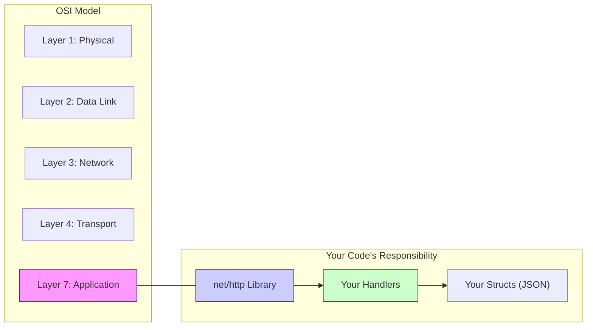
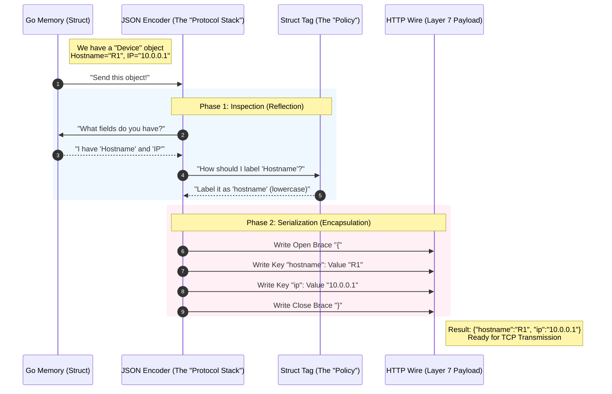
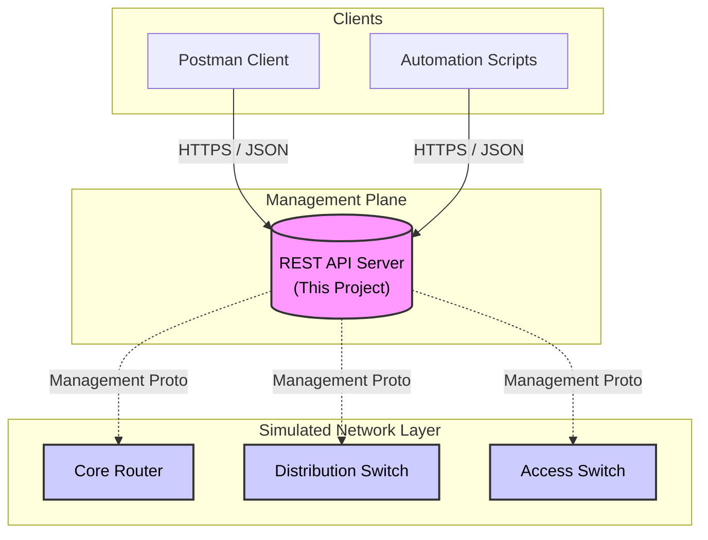
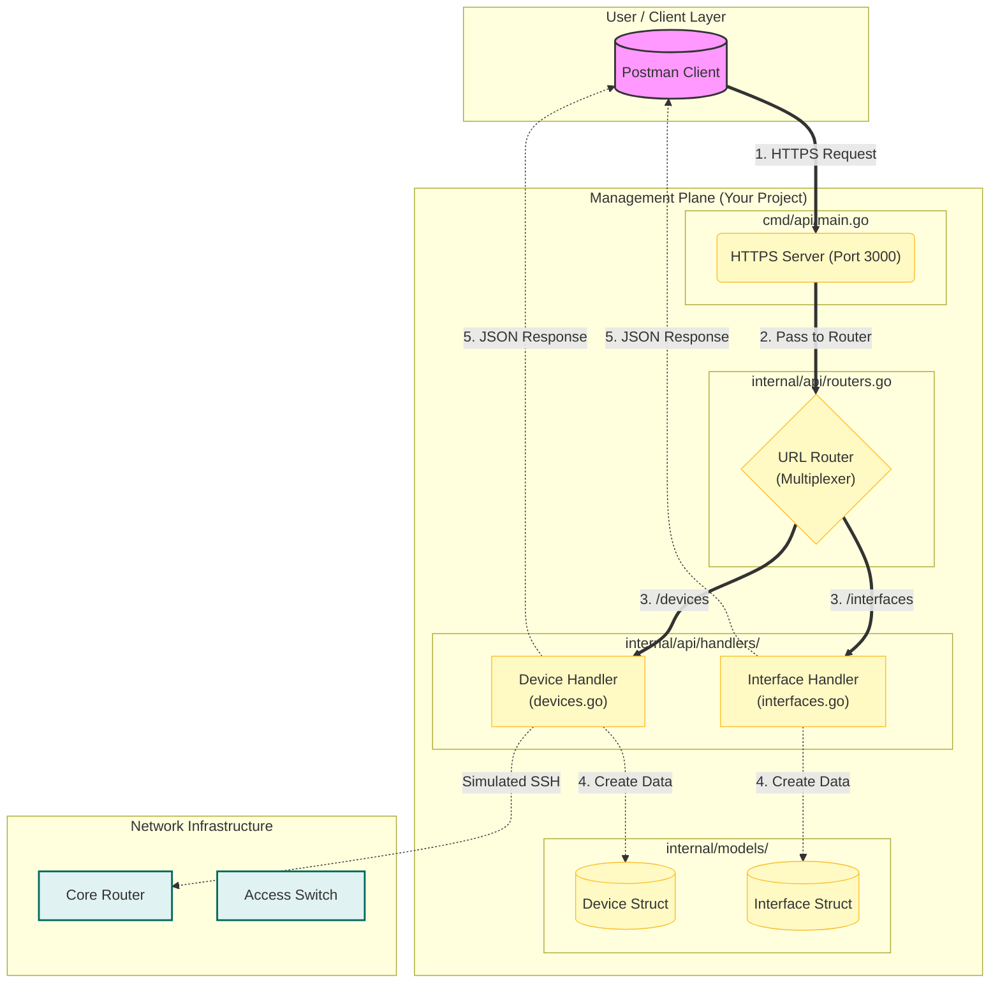

# Network Management API

## Project Overview
This project demonstrates the fundamental architecture of a RESTful API designed for a Network Management System. It provides a transparent view into how HTTP requests are processed, routed, and handled in a Go-based microservice environment.

The core objective is to manage network entities—specifically Devices and Interfaces—providing a foundational backend for network automation platforms.

## Architecture and Request Flow

The following diagram illustrates the transparent lifecycle of a request within this API. It details the journey from the client to the specific Data Model and back.

## For Network Engineers: The "Layer 7" Perspective

If you are coming from a Routing & Switching background, "Code" can look abstract. Let's map this project to the **OSI Model** / **TCP/IP Stack** you already know.

### Where does this API live?
This entire project runs at **Layer 7 (Application Layer)**.

*   **Layer 4 (Transport)**: The OS handles the TCP connection (SYN, SYN-ACK, ACK) on Port 3000.
*   **Layer 7 (Application)**: Our Go code takes the raw data stream from Layer 4 and processes it as HTTP.



---

### Deep Dive: JSON Marshaling = Data Encapsulation

In networking, **Encapsulation** is when you take data (payload) and wrap it with headers (IP Header, TCP Header) to make it travel-ready.

**JSON Marshaling** is exactly the same concept.

*   **The Payload**: Your Go Struct (the raw data in memory).
*   **The Encapsulation**: The JSON formatting (`{ "key": "value" }`) wraps your data so it can travel over the wire (HTTP Body).
*   **The Tag (`json:"ip"`)**: Think of this like a **Protocol Field**. It tells the "Encapsulator" exactly how to format the header for that specific piece of data.

#### The "Packet Flow" of a JSON Object

Here is the naked truth of how a Go Struct becomes a JSON Byte Stream:



## System Topology

This diagram visualizes the high-level management plane topology. The **API Server** acts as the central control point, abstracting the complexity of the underlying network hardware from the client.

## High-Level Topology

This diagram visualizes the macro-view of the Management Plane.



## System Topology (Exploded View)

This diagram opens up the "Black Box" of the API Server. It shows exactly how a request flows through the internal layers of your project structure (`cmd`, `internal/api`, `internal/models`).



**What you are seeing:**
1.  **Entry**: The request hits `main.go`.
2.  **Routing**: `routers.go` decides where it goes.
3.  **Handling**: The specific code in `handlers/` executes.
4.  **Modeling**: The code uses blueprints from `models/` to structure data.
5.  **Response**: The structured data is sent back to Postman.

## Internal Components

### 1. Entry Point (Server Layer)
Located in `cmd/api/main.go`, this layer is responsible for:
- Configuring the TLS (Transport Layer Security) settings.
- Initializing the standard Go HTTP server.
- Binding the application to a specific network port (Port 3000).

### 2. Router (Dispatch Layer)
Located in `internal/api/routers.go`.
- Acts as the traffic controller.
- Maps specific URL patterns (e.g., `/devices`) to the corresponding execution logic.
- Ensures requests are directed to the correct handler function.

### 3. Handlers (Logic Layer)
Located in `internal/api/handlers/`.
- **Devices Handler**: Manages logical operations for network hardware (routers, switches).
- **Interfaces Handler**: Manages logical operations for network ports.
- Responsible for constructing the HTTP response headers (e.g., `Content-Type: application/json`) and encoding the data.

### 4. Models (Data Layer)
Located in `internal/models/`.
- Defines the strict schema for data entities using Go structs.
- **Device**: Defines properties like `Hostname`, `IP`, `Model`, `OS`.
- **Interface**: Defines properties like `Name`, `Status`, `IPAddress`.


## Getting Started

### Prerequisites
- Go 1.22 or higher
- Postman (for API testing)

### Installation and Execution

1.  **Build the Project:**
    ```bash
    go build -o bin/api.exe ./cmd/api
    ```

2.  **Run the Server:**
    ```bash
    ./bin/api.exe
    ```
    The server will start on `https://localhost:3000`.

3.  **API Endpoints:**

    | Method | Endpoint      | Description                          |
    |:-------|:--------------|:-------------------------------------|
    | GET    | `/devices`    | Retrieves a list of network devices. |
    | GET    | `/interfaces` | Retrieves a list of interfaces.      |

## Technical Note on Security
This project uses self-signed certificates for HTTPS.
In a production environment, strict Mutual TLS (mTLS) can be enforced by modifying the `TLSConfig` in the server entry point. For development transparency, client certificate verification is currently optional.