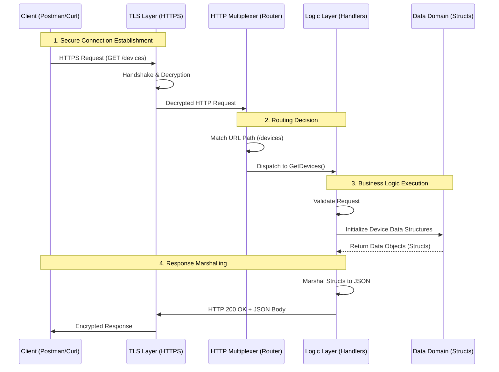

# Network Management API

## Project Overview
This project demonstrates the fundamental architecture of a RESTful API designed for a Network Management System. It provides a transparent view into how HTTP requests are processed, routed, and handled in a Go-based microservice environment.

The core objective is to manage network entities—specifically Devices and Interfaces—providing a foundational backend for network automation platforms.

## Architecture and Request Flow

The following diagram illustrates the transparent lifecycle of a request within this API. It details the journey from the client to the specific Data Model and back.



## Internal Components

### 1. Entry Point (Server Layer)
Located in `cmd/api/main.go`, this layer is responsible for:
- Configuring the TLS (Transport Layer Security) settings.
- Initializing the standard Go HTTP server.
- Binding the application to a specific network port (Port 3000).

### 2. Router (Dispatch Layer)
Located in `internal/api/routers.go`.
- Acts as the traffic controller.
- Maps specific URL patterns (e.g., `/devices`) to the corresponding execution logic.
- Ensures requests are directed to the correct handler function.

### 3. Handlers (Logic Layer)
Located in `internal/api/handlers/`.
- **Devices Handler**: Manages logical operations for network hardware (routers, switches).
- **Interfaces Handler**: Manages logical operations for network ports.
- Responsible for constructing the HTTP response headers (e.g., `Content-Type: application/json`) and encoding the data.

### 4. Models (Data Layer)
Located in `internal/models/`.
- Defines the strict schema for data entities using Go structs.
- **Device**: Defines properties like `Hostname`, `IP`, `Model`, `OS`.
- **Interface**: Defines properties like `Name`, `Status`, `IPAddress`.

## Getting Started

### Prerequisites
- Go 1.22 or higher
- Postman (for API testing)

### Installation and Execution

1.  **Build the Project:**
    ```bash
    go build -o bin/api.exe ./cmd/api
    ```

2.  **Run the Server:**
    ```bash
    ./bin/api.exe
    ```
    The server will start on `https://localhost:3000`.

3.  **API Endpoints:**

    | Method | Endpoint      | Description                          |
    |:-------|:--------------|:-------------------------------------|
    | GET    | `/devices`    | Retrieves a list of network devices. |
    | GET    | `/interfaces` | Retrieves a list of interfaces.      |

## Technical Note on Security
This project uses self-signed certificates for HTTPS.
In a production environment, strict Mutual TLS (mTLS) can be enforced by modifying the `TLSConfig` in the server entry point. For development transparency, client certificate verification is currently optional.