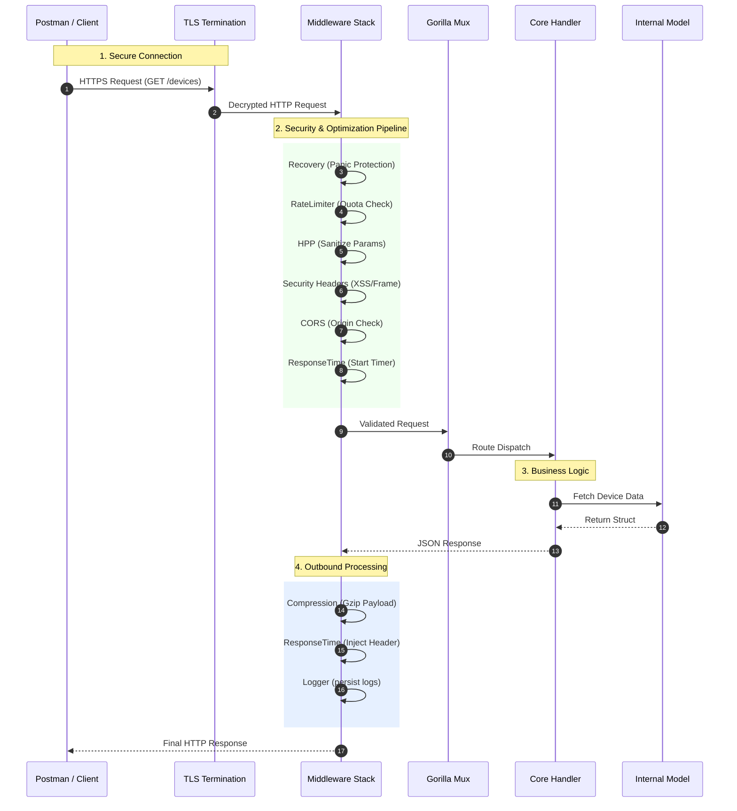

# Network Management API

## Project Overview
This project serves as a robust, production-ready backend framework designed for Network Management Systems (NMS). Built with Go, it demonstrates a scalable microservice architecture capable of managing critical network entities such as Devices and Interfaces. 

The API is engineered for transparency, security, and performance, providing a clear reference implementation for handling high-concurrency network automation tasks.

## Request Lifecycle Simulation

The following diagram visualizes the exact path a request takes from a client (like Postman) through our security and processing layers before reaching the core logic.



## Middleware Architecture

This API employs a sophisticated chain of middlewares to ensure stability, security, and observability. Every request passes through this pipeline.

| Middleware | Role | Header Injection / Effect |
| :--- | :--- | :--- |
| **Recovery** | **Stability** | Catches generic panics to prevent server crashes. Returns `500 Internal Server Error` if critical failure occurs. |
| **Rate Limiter** | **Traffic Control** | Prevents abuse by limiting requests per IP. Returns `429 Too Many Requests` if quota is exceeded. |
| **HPP** | **Security** | **HTTP Parameter Pollution**. Cleans duplicate query parameters (e.g., `?id=1&id=2` → `?id=1`) to prevent injection attacks. |
| **Security Headers** | **Security** | `X-XSS-Protection: 1; mode=block`<br>`X-Frame-Options: DENY`<br>`X-Content-Type-Options: nosniff`<br>`Content-Security-Policy: default-src 'self'` |
| **CORS** | **Access Control** | `Access-Control-Allow-Origin: <origin>`<br>Controls which domains can access the API. |
| **Response Time** | **Observability** | `X-Response-Time: 12.34ms`<br>Measures the exact processing duration for performance monitoring. |
| **Logger** | **Audit** | Server-side logging of `Method`, `Path`, `Status`, and `Duration`. |
| **Compression** | **Performance** | `Content-Encoding: gzip`<br>Compresses response bodies if the client sends `Accept-Encoding: gzip`. |

## API Integration & Usage

### Prerequisites
*   **Go**: v1.22+
*   **Postman**: For testing API endpoints.

### Installation

1.  **Build the Service:**
    ```bash
    go build -o bin/api.exe ./cmd/api
    ```

2.  **Run the Server:**
    ```bash
    ./bin/api.exe
    # Server starts on https://localhost:3000
    ```

### Postman / cURL Examples

#### 1. Get All Devices
Retrieves the inventory of managed network devices.

**Request:**
```http
GET https://localhost:3000/devices
Accept: application/json
```

**Response:**
```json
{
    "message": "Hello GET Method on Devices Route"
}
```

#### 2. Test Rate Limiting
Flood the server to trigger the protection mechanism.

**Request:**
```bash
for i in {1..200}; do curl -k -I https://localhost:3000/devices; done
```

**Response (after limit):**
```http
HTTP/1.1 429 Too Many Requests
Content-Type: text/plain; charset=utf-8
```

#### 3. Test Compression & Response Time
Verify network optimizations.

**Request:**
```bash
curl -k -I -H "Accept-Encoding: gzip" https://localhost:3000/devices
```

**Response Headers:**
```http
HTTP/1.1 200 OK
Content-Encoding: gzip
X-Response-Time: 142.5µs
Content-Type: application/json
```

## System Topology (Detailed Architecture)

This diagram provides an "Exploded View" of the entire system, illustrating the precise flow of data from the external client, through the internal software layers, down to the data models, and out to the simulated network infrastructure.

```mermaid
graph TD
    %% Global Styles
    classDef client fill:#e1f5fe,stroke:#01579b,stroke-width:2px;
    classDef security fill:#fce4ec,stroke:#880e4f,stroke-width:2px;
    classDef core fill:#e8f5e9,stroke:#1b5e20,stroke-width:2px;
    classDef infra fill:#fff3e0,stroke:#e65100,stroke-width:2px;

    subgraph "External World"
        Postman[("Postman / Client")]:::client
    end

    subgraph "API Gateway (cmd/api)"
        HTTPS["HTTPS/TLS Termination<br/>(Port 3000)"]:::security
    end

    subgraph "Middleware Pipeline (Internal/api/middlewares)"
        direction TB
        MW_Rec[Recovery (Panic Catch)]:::security
        MW_Rate[Rate Limiter (Token Bucket)]:::security
        MW_HPP[HPP (Param Sanitize)]:::security
        MW_Sec[Security Headers / CORS]:::security
        MW_Obs[ResponseTime & Logger]:::security
        MW_Comp[Compression (Gzip)]:::security
        
        MW_Rec --> MW_Rate --> MW_HPP --> MW_Sec --> MW_Obs --> MW_Comp
    end

    subgraph "Routing & Logic (Internal/api)"
        Router{"Gorilla Mux<br/>(Router)"}:::core
        
        subgraph "Handler Layer"
            H_Dev["Devices Handler"]:::core
            H_Int["Interfaces Handler"]:::core
        end

        subgraph "Data Layer (Internal/models)"
            M_Dev[("Device Model<br/>(Struct)")]:::core
            M_Int[("Interface Model<br/>(Struct)")]:::core
        end
    end

    subgraph "Simulated Network Infrastructure (Leaf-Spine Fabric)"
        subgraph "Spine Layer (Super-Core)"
            Spine1["Spine-1<br/>(SRL 7250)"]:::infra
            Spine2["Spine-2<br/>(SRL 7250)"]:::infra
        end

        subgraph "Leaf Layer (ToR)"
            Leaf1["Leaf-1<br/>(SRL 7220)"]:::infra
            Leaf2["Leaf-2<br/>(SRL 7220)"]:::infra
            Leaf3["Leaf-3<br/>(SRL 7220)"]:::infra
        end
        
        %% Leaf-Spine Mesh Connections
        Spine1 --- Leaf1 & Leaf2 & Leaf3
        Spine2 --- Leaf1 & Leaf2 & Leaf3
        
        YANG_Store[("YANG Datastore")]:::infra
    end

    %% Flow Connections
    Postman ==>|1. HTTPS Request| HTTPS
    HTTPS ==>|2. Raw Stream| MW_Rec
    MW_Comp ==>|3. Validated Request| Router

    Router ==>|4. Route: /devices| H_Dev
    Router ==>|4. Route: /interfaces| H_Int

    H_Dev -.->|5. Map Data| M_Dev
    H_Int -.->|5. Map Data| M_Int

    H_Dev -.->|6. RESTCONF (Config)| Spine1
    H_Dev -.->|6. RESTCONF (Config)| Leaf1
    H_Int -.->|7. gNMI (Telemetry)| Spine2
    H_Int -.->|7. gNMI (Telemetry)| Leaf2
    H_Int -.->|7. gNMI (Telemetry)| YANG_Store

    %% Return Path (Implicit)
    H_Dev -.->|8. JSON Response| MW_Comp
```

**Flow Description:**
1.  **Entry**: Client connects via HTTPS.
2.  **Pipeline**: Request traverses the middleware stack (Security -> Observability -> Rate Limiting).
3.  **Routing**: The multiplexer directs traffic to the correct handler (`/devices` vs `/interfaces`).
4.  **Logic**: Handlers execute business logic, interacting with Data Models.
5.  **Interaction**: The system uses a hybrid approach to manage a **Clos (Leaf-Spine) Fabric**:
    *   **RESTCONF**: Pushes configuration to Spines and Leafs (e.g., BGP EVPN fabric setup).
    *   **gNMI (gRPC)**: Streams telemetry from the entire fabric to monitor health.
6.  **Response**: Data flows back up the stack, getting compressed and logged before reaching the client.