# Network Management API

## Project Overview
This project demonstrates the fundamental architecture of a RESTful API designed for a Network Management System. It provides a transparent view into how HTTP requests are processed, routed, and handled in a Go-based microservice environment.

The core objective is to manage network entities—specifically Devices and Interfaces—providing a foundational backend for network automation platforms.

## Architecture and Request Flow

The following diagram illustrates the transparent lifecycle of a request within this API. It details the journey from the client to the specific Data Model and back.

```mermaid
sequenceDiagram
    participant Client as Client (Postman/Curl)
    participant TLS as TLS Layer (HTTPS)
    participant Mux as HTTP Multiplexer (Router)
    participant Handler as Logic Layer (Handlers)
    participant Model as Data Domain (Structs)

    Note over Client, TLS: 1. Secure Connection Establishment
    Client->>TLS: HTTPS Request (GET /devices)
    TLS->>TLS: Handshake & Decryption
    TLS->>Mux: Decrypted HTTP Request

    Note over Mux, Handler: 2. Routing Decision
    Mux->>Mux: Match URL Path (/devices)
    Mux->>Handler: Dispatch to GetDevices()

    Note over Handler, Model: 3. Business Logic Execution
    Handler->>Handler: Validate Request
    Handler->>Model: Initialize Device Data Structures
    Model-->>Handler: Return Data Objects (Structs)

    Note over Handler, Client: 4. Response Marshalling
    Handler->>Handler: Marshal Structs to JSON
    Handler->>TLS: HTTP 200 OK + JSON Body
    TLS->>Client: Encrypted Response
```



## System Topology

This diagram visualizes the high-level management plane topology. The **API Server** acts as the central control point, abstracting the complexity of the underlying network hardware from the client.


## Internal Components

### 1. Entry Point (Server Layer)
Located in `cmd/api/main.go`, this layer is responsible for:
- Configuring the TLS (Transport Layer Security) settings.
- Initializing the standard Go HTTP server.
- Binding the application to a specific network port (Port 3000).

### 2. Router (Dispatch Layer)
Located in `internal/api/routers.go`.
- Acts as the traffic controller.
- Maps specific URL patterns (e.g., `/devices`) to the corresponding execution logic.
- Ensures requests are directed to the correct handler function.

### 3. Handlers (Logic Layer)
Located in `internal/api/handlers/`.
- **Devices Handler**: Manages logical operations for network hardware (routers, switches).
- **Interfaces Handler**: Manages logical operations for network ports.
- Responsible for constructing the HTTP response headers (e.g., `Content-Type: application/json`) and encoding the data.

### 4. Models (Data Layer)
Located in `internal/models/`.
- Defines the strict schema for data entities using Go structs.
- **Device**: Defines properties like `Hostname`, `IP`, `Model`, `OS`.
- **Interface**: Defines properties like `Name`, `Status`, `IPAddress`.

### 5. Deep Dive: The Data Transformation (Marshaling)

This is the most critical part of understanding a REST API. It is the process of converting "Memory Code" into "Network Text".

#### What is Marshaling?
**Marshaling** is the act of taking a Go Struct (a data object living in the server's RAM) and turning it into a JSON string that can be sent over the internet.

#### What is Unmarshaling?
**Unmarshaling** is the reverse: taking a JSON string received from the internet and converting it back into a Go Struct so the code can understand and use it.

The following diagram visualizes this "Translation" process, showing exactly how the `json:"tags"` in our code act as the translator.

```mermaid
graph LR
    subgraph "Go Memory (RAM)"
        direction TB
        Struct[("Struct: Device")]
        Field1["Hostname (string)"]
        Field2["IP (string)"]
        Field3["Model (string)"]
    end

    subgraph "Translation Layer"
        Tag1{{"`json:\"hostname\"`"}}
        Tag2{{"`json:\"ip\"`"}}
        Tag3{{"`json:\"model\"`"}}
    end

    subgraph "Network Data (JSON)"
        JsonOpen["{"]
        Key1["hostname: core-router-01"]
        Key2["ip: 192.168.1.1"]
        Key3["model: Cisco ASR 1000"]
        JsonClose["}"]
    end

    %% Wiring
    Struct --- Field1
    Struct --- Field2
    Struct --- Field3

    Field1 -->|Marshal| Tag1 --> Key1
    Field2 -->|Marshal| Tag2 --> Key2
    Field3 -->|Marshal| Tag3 --> Key3

    Key1 -.->|Unmarshal| Tag1 -.-> Field1
    Key2 -.->|Unmarshal| Tag2 -.-> Field2
    Key3 -.->|Unmarshal| Tag3 -.-> Field3

    style Struct fill:#FFD700,color:black
    style JsonOpen fill:#fff,stroke:none
    style JsonClose fill:#fff,stroke:none
    style Tag1 fill:#f96,color:white
    style Tag2 fill:#f96,color:white
    style Tag3 fill:#f96,color:white
```

**Key Takeaway:** The `json:"..."` tags in `internal/models/device.go` are the instructions for this machine. Without them, the API would not know how to name the keys in the response.

## Getting Started

### Prerequisites
- Go 1.22 or higher
- Postman (for API testing)

### Installation and Execution

1.  **Build the Project:**
    ```bash
    go build -o bin/api.exe ./cmd/api
    ```

2.  **Run the Server:**
    ```bash
    ./bin/api.exe
    ```
    The server will start on `https://localhost:3000`.

3.  **API Endpoints:**

    | Method | Endpoint      | Description                          |
    |:-------|:--------------|:-------------------------------------|
    | GET    | `/devices`    | Retrieves a list of network devices. |
    | GET    | `/interfaces` | Retrieves a list of interfaces.      |

## Technical Note on Security
This project uses self-signed certificates for HTTPS.
In a production environment, strict Mutual TLS (mTLS) can be enforced by modifying the `TLSConfig` in the server entry point. For development transparency, client certificate verification is currently optional.