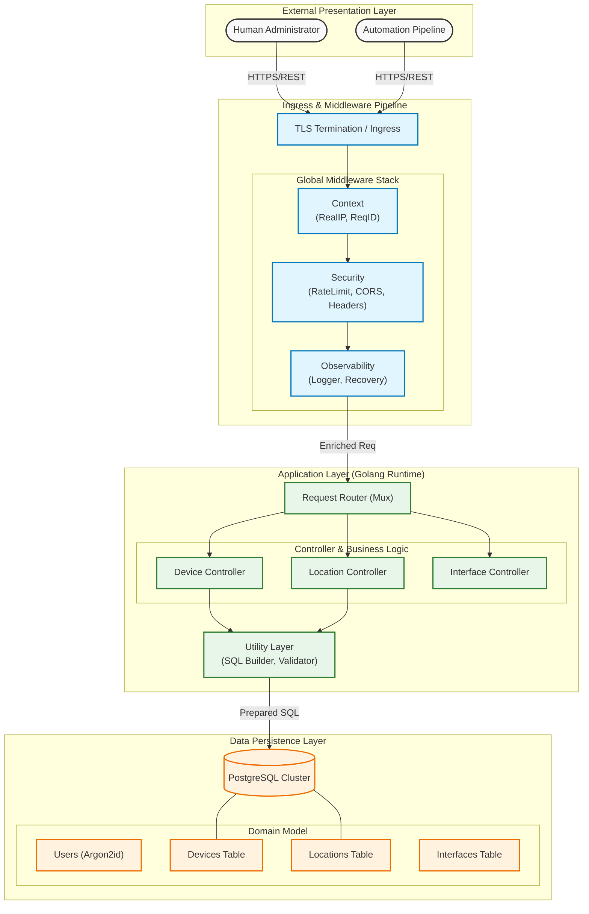

# Enterprise Network Inventory API

> **A High-Performance, Production-Grade REST API for Network Asset Management**


---

## Table of Contents

- [Executive Summary](#executive-summary)
- [System Model & Architecture](#system-model--architecture)
- [Key Features](#key-features)
- [Technology Stack](#technology-stack)
- [Getting Started](#getting-started)
- [Quick Reference](#quick-reference)
- [Postman API Guide](#postman-api-guide)
- [Tutorial: Full Lifecycle](#tutorial-full-entity-lifecycle-step-by-step)
- [Security & Validation](#security--validation)
- [Postman Pro Tips](#postman-pro-automation--scripting)
- [Contributing](#contributing)
- [License](#license)

---

## Executive Summary

This project creates a scalable back-end infrastructure for managing complex network inventories. Designed with **Golang**, it prioritizes **low latency**, **concurrency**, and **maintainability**. It serves as a single source of truth for physical assets (Locations), network devices (Switches/Routers), and logical configurations (VLANs/Interfaces).

Ideally suited for:
- **ISPs & Telecoms**: Tracking thousands of devices.
- **Enterprise IT**: Managing campus networks.
- **Data Centers**: Automating infrastructure documentation.

---

## System Model & Architecture

The following diagram illustrates the **Layered Architecture** of the system, demonstrating the separation of concerns between presentation, application logic, and data persistence layers.



---

## Key Features

*   **Blazing Fast**: Native implementation in Go without heavy frameworks.
*   **Secure by Design**:
    *   **TLS 1.2+ Enforcement**: No insecure connections. All endpoints are HTTPS.
    *   **Modern Auth**: JWT-ready structure with Argon2id password hashing.
    *   **Rate Limiting**: IP-based throttling to prevent abuse.
    *   **Security Headers**: Protecting against XSS, Clickjacking, and Sniffing.
*   **Docker Native**: Ready to deploy with a single command via Docker Compose.
*   **Massive Scalability**: Tested with generated datasets of 1000+ interfaces.
*   **Advanced Filtering**: Granular search capabilities on every resource.
*   **Standardized API**: Consistent JSON responses and error handling.
*   **Audit Ready**: Detailed logging of every request's duration and status.
*   **Full Observability**: Integrated **Request ID** tracing and **Real IP** resolution.
*   **RFC Compliance**: Strictly standardized JSON error responses (RFC 8259).

---

## Technology Stack

| Component | Technology | Description |
| :--- | :--- | :--- |
| **Language** | [Go (Golang)](https://go.dev/) | 1.21+ for high concurrency and performance. |
| **Database** | [PostgreSQL](https://www.postgresql.org/) | Relational data integrity (UUIDs, Foreign Keys). |
| **Routing** | [Gorilla Mux](https://github.com/gorilla/mux) | Robust request routing. |
| **Container** | [Docker](https://www.docker.com/) | Standardized deployment environment. |
| **Management** | [PgAdmin 4](https://www.pgadmin.org/) | Web-based database management GUI. |

---

## Getting Started

### Prerequisites

*   **Docker Desktop** (Required)
*   **Make** (Recommended for automation)
*   **Go 1.21+** (Only for local dev without Docker)
*   **cURL** or **Postman** (For testing)

### Quick Start (One-Liner)

The project includes a robust `Makefile` for automation. To start the entire stack (Database + API + Admin GUI) and populate it with seed data:

```bash
make start
```

This will:
1.  Spin up Postgres and PgAdmin containers.
2.  Wait for the database to be healthy.
3.  **Automatically run migrations** (`init.sql`) to create tables.
4.  **Seed the database** (`seed_manual.sql`) with massive data sets (Locations, Devices, Interfaces).
5.  Start the API server at `https://localhost:3000`.

### Other Commands

```bash
make build       # Compile the binary to /bin
make run         # Run locally (requires external DB)
make clean       # Remove build artifacts
make up          # Start Docker containers only
make down        # Stop all containers
make reset_db    # The "Nuclear Option": Wipes DB volume and re-seeds data
make gen-certs   # Generate new SSL certificates
```

---

## Quick Reference

*   **Base URL:** `https://localhost:3000`
*   **TLS/SSL:** Self-signed certificates (use `-k` in curl or disable verification in Postman).
*   **Admin Credentials:**
    *   **Username:** `admin`
    *   **Password:** `admin123`
*   **ID Format:** Standard **UUIDs** (e.g., `550e8400-e29b-41d4-a716-446655440000`).

---

## Postman API Guide

### 1. Authentication & Session Control
Verify credentials and receive an Argon2id-hashed session token.

| Feature        | Details                                     |
| :------------- | :------------------------------------------ |
| **Method**     | `POST`                                      |
| **URL**        | `https://localhost:3000/users/login`        |
| **Body (JSON)**| `{"username": "admin", "password": "admin123"}` |

---

### 2. Device Inventory (Physical Assets)

#### **A. Basic Listing**
- **Method**: `GET`
- **URL**: `https://localhost:3000/devices` (List all)
- **URL**: `https://localhost:3000/devices/{UUID}` (Specific)

#### **B. Vendor & Status Filtering**
- **Method**: `GET`
- **URL**: `https://localhost:3000/devices?vendor=Cisco&status=active`
- **URL**: `https://localhost:3000/devices?vendor=SpaceX&status=provisioning`
- **URL**: `https://localhost:3000/devices?vendor=Nokia&status=active` (ISP Core Units)

#### **C. Advanced Sorting (Multi-Field)**
- **Method**: `GET`
- **URL**: `https://localhost:3000/devices?sortby=vendor:asc,hostname:desc`
- **URL**: `https://localhost:3000/devices?sortby=created_at:desc,status:asc`
- **URL**: `https://localhost:3000/devices?sortby=model:asc,vendor:desc`

#### **D. Industry Scenarios (FinTech, ISP & Space)**
- **Method**: `GET`
- **URL**: `https://localhost:3000/devices?model=7130%20Connect` (Arista HFT Switches)
- **URL**: `https://localhost:3000/devices?model=7750%20SR-12` (Nokia Service Routers)
- **URL**: `https://localhost:3000/devices?vendor=SpaceX&model=Starlink%20v2` (Satellite Nodes)

#### **E. Onboard / Update Devices**
- **Method**: `POST` (New Device)
- **URL**: `{{base_url}}/devices`
- **Body**: Standard Device JSON.
- **Method**: `PATCH` (Modify Configuration)
- **URL**: `{{base_url}}/devices/{UUID}`
- **Body**: `{"status": "maintenance", "ip": "10.0.0.50"}`
- **Method**: `PUT` (Full Replace)
- **URL**: `{{base_url}}/devices/{UUID}`
- **Body**: Complete **Device JSON** including all required fields.

---

### 3. Interface Management (Logical & Optical)

#### **A. High-Speed Link Queries**
- **Method**: `GET`
- **URL**: `https://localhost:3000/interfaces?speed=400Gbps` (Terabit Backbone)
- **URL**: `https://localhost:3000/interfaces?speed=100Gbps&sortby=name:asc`
- **URL**: `https://localhost:3000/interfaces?speed=10Gbps&status=up` (Branch Uplinks)

#### **B. Space & Satellite Ops**
- **Method**: `GET`
- **URL**: `https://localhost:3000/interfaces?type=laser` (Inter-Satellite Interconnects)
- **URL**: `https://localhost:3000/interfaces?description=eCPRI` (5G Fronthaul)
- **URL**: `https://localhost:3000/interfaces?type=optical&speed=100Gbps` (Subsea Links)

#### **C. Status & Multi-Sorting**
- **Method**: `GET`
- **URL**: `https://localhost:3000/interfaces?status=down&sortby=speed:desc,name:asc`
- **URL**: `https://localhost:3000/interfaces?type=fiber&status=up`
- **URL**: `https://localhost:3000/interfaces?status=maintenance&sortby=description:asc`

#### **D. Bulk Operations**
- **Method**: `PATCH`
- **URL**: `https://localhost:3000/interfaces`
- **Body**: 
```json
[
  {"id": "IF_UUID_1", "status": "down", "description": "Emergency Lockout"},
  {"id": "IF_UUID_2", "status": "down", "description": "Maintenance"}
]
```

---

### 4. Site & Location Management

#### **A. Global Hierarchy**
- **Method**: `GET`
- **URL**: `https://localhost:3000/locations`
- **URL**: `https://localhost:3000/locations?country=Turkey` (Filter by Country)

#### **B. Site Inventory Traversal**
- **Method**: `GET`
- **URL**: `https://localhost:3000/locations/{LOC_UUID}/devices` (Get all hardware at site)

#### **C. Administrative CRUD**
- **Method**: `POST` (Register Site)
- **Body**: `{"name": "Istanbul DC", "city": "Istanbul", "country": "Turkey", "address": "Maslak"}`
- **Method**: `DELETE` (Decommission Site)
- **URL**: `https://localhost:3000/locations/{UUID}`

---

### 5. Logical Assets (VLANs)

#### **A. Range & ID Filtering**
- **Method**: `GET`
- **URL**: `https://localhost:3000/vlans?vlan_id=80` (Storage SAN)
- **URL**: `https://localhost:3000/vlans?sortby=vlan_id:asc`
- **URL**: `https://localhost:3000/vlans?vlan_id=100` (Management)

#### **B. Functional Search**
- **Method**: `GET`
- **URL**: `https://localhost:3000/vlans?name=5G` (Mobile Core Segments)
- **URL**: `https://localhost:3000/vlans?name=HFT` (Trading Data Segments)
- **URL**: `https://localhost:3000/vlans?name=GUEST&status=active`

#### **C. Full Multi-Sort**
- **Method**: `GET`
- **URL**: `https://localhost:3000/vlans?sortby=name:desc,vlan_id:asc`
- **URL**: `https://localhost:3000/vlans?sortby=vlan_id:desc,id:asc`

---

### 6. Query Masterclass (Combined Logic)

| Requirement                        | Method | Full Request URL Path                                                                 |
| :--------------------------------- | :----- | :------------------------------------------------------------------------------------ |
| **Simple Listing**                 | `GET`  | `/devices`                                                                            |
| **Get Specific User Settings**     | `GET`  | `/users/{UUID}`                                                                       |
| **Newest Inventory First**         | `GET`  | `/devices?sortby=created_at:desc`                                                    |
| **Backbone Interface Sort**        | `GET`  | `/interfaces?speed=400Gbps&sortby=name:asc`                                           |
| **Down Status (Fiber Only)**       | `GET`  | `/interfaces?type=fiber&status=down&sortby=speed:desc,name:asc`                       |
| **Inactive Accounts Search**       | `GET`  | `/users?inactive_status=true`                                                         |
| **Turkey Hub Multi-Sort**          | `GET`  | `/locations?country=Turkey&sortby=city:asc,name:desc`                                 |
| **FinTech VLANs (High ID First)**  | `GET`  | `/vlans?name=HFT&sortby=vlan_id:desc`                                                 |
| **Bulk Interface Shutdown**        | `PATCH`| `/interfaces` (With JSON Body Array)                                                  |
| **Total Inventory Purge (Nuclear)**| `DEL`  | `/locations/{UUID}` (Cascade delete enabled in DB)                                    |


---

## Tutorial: Full Entity Lifecycle (Step-by-Step)

Follow these scenarios to master every method available in the API.

### A. Device Lifecycle (Scenario: ISP Border Router)

1.  **POST (Create)**: Register a new Nokia Service Router.
    - **URL**: `https://localhost:3000/devices`
    - **Body**: `{"hostname": "br-ist-core-01", "ip": "100.100.100.1", "model": "7750 SR-1s", "vendor": "Nokia", "os": "SR OS", "status": "active", "location_id": "{LOC_UUID}"}`
2.  **GET (Verify)**: List all Nokia devices to find your new router.
    - **URL**: `https://localhost:3000/devices?vendor=Nokia&sortby=hostname:asc`
3.  **PATCH (Update)**: Set the router to maintenance mode for a firmware upgrade.
    - **URL**: `https://localhost:3000/devices/{UUID}`
    - **Body**: `{"status": "maintenance"}`
4.  **PUT (Full Replace)**: Transition to a new hardware model and IP while keeping the same UUID.
    - **URL**: `https://localhost:3000/devices/{UUID}`
    - **Body**: `{"hostname": "br-ist-core-01-v2", "ip": "100.100.100.2", "model": "7750 SR-12", "vendor": "Nokia", "os": "SR OS v22", "status": "active"}`
5.  **DELETE (Remove)**: Decommission the legacy router.
    - **URL**: `https://localhost:3000/devices/{UUID}`

### B. Interface Operations (Scenario: 400Gbps Backbone Link)

1.  **POST (Provision)**: Create the primary 400G optical port.
    - **URL**: `https://localhost:3000/interfaces`
    - **Body**: `{"device_id": "{DEV_UUID}", "name": "400GE1/1/1", "description": "Inter-AS Link", "type": "fiber", "speed": "400Gbps", "status": "up"}`
2.  **GET (Audit)**: Search for all terabit-scale interfaces.
    - **URL**: `https://localhost:3000/interfaces?speed=400Gbps&sortby=status:asc`
3.  **PATCH (Bulk)**: Shutdown multiple backbone links for emergency fiber repair.
    - **URL**: `https://localhost:3000/interfaces`
    - **Body**: `[{"id": "{IF_UUID_1}", "status": "down"}, {"id": "{IF_UUID_2}", "status": "down"}]`
4.  **DELETE**: Clean up an incorrectly provisioned test port.
    - **URL**: `https://localhost:3000/interfaces/{UUID}`

### C. VLAN Provisioning (Scenario: Low-Latency HFT Segment)

1.  **POST**: Define a new ultra-low latency multicast VLAN.
    - **URL**: `https://localhost:3000/vlans`
    - **Body**: `{"vlan_id": 105, "name": "NY4-Mcast-Feed", "description": "NYSE Data Feed"}`
2.  **GET**: Verify the VLAN exists and check its sort position.
    - **URL**: `https://localhost:3000/vlans?sortby=vlan_id:asc&name=NY4`
3.  **PATCH**: Update description to include specific sub-feeds.
    - **URL**: `https://localhost:3000/vlans/{UUID}`
    - **Body**: `{"description": "NYSE Data Feed (Equinix NY4 Hub)"}`
4.  **DELETE**: Remove VLAN after the market data session ends.
    - **URL**: `https://localhost:3000/vlans/{UUID}`

---

## Security & Validation

This project implements industry-standard security practices and strict data validation to ensure network integrity.

### 1. Security Overview
- **Strict Transport Security**: All connections are TLS 1.2+ encrypted.
- **Rate Limiting**: `60 requests / minute` per IP (Default).
- **Authentication**: Argon2id for secure password hashing.
- **XSS Protection**: `X-XSS-Protection: 1; mode=block`.
- **No Sniff**: `X-Content-Type-Options: nosniff`.
- **SQL Injection Prevention**: All queries use **Parameterized Queries ($1, $2)**.

### 2. Cookie Management
The API uses secure, server-side cookies for session management. When you log in via `/users/login`, the server issues a `Bearer` cookie with:
- **HttpOnly** | **Secure** | **SameSite=Strict** | **MaxAge=24h**

### 3. Data Validation Examples (Proving Integrity)
These examples demonstrate how the API handles invalid inputs.

- **Invalid IP Format**: `POST {{base_url}}/devices` with `{"ip": "999.999.999.999"}` -> `400 Bad Request`
- **VLAN Range Check**: `POST {{base_url}}/vlans` with `{"vlan_id": 5000}` -> `400 Bad Request`
- **Missing Required Fields**: `POST {{base_url}}/users` with empty fields -> `400 Bad Request`

---

## Authentication Guide

The API utilizes a modern, hybrid **JWT (JSON Web Token)** authentication system designed for both programmatic clients (CLI/Mobile) and Web Browsers.

### 1. The Token & Cookie Concept
We implement a **Dual-Delivery** mechanism for the authentication token:

1.  **The Token (Bearer)**:
    *   **What is it?**: A signed JWT containing the User ID, Username, and Role.
    *   **Use Case**: Mobile Apps, CLIs, Postman, and external scripts.
    *   **How to use**: Send it in the Header: `Authorization: Bearer <your_token>`.

2.  **The Cookie (HttpOnly)**:
    *   **What is it?**: The exact same JWT, stored in a secure, server-side Cookie.
    *   **Use Case**: Web Applications (React, Vue, etc.).
    *   **Security**: The cookie is `HttpOnly` (JavaScript cannot read it), `Secure` (HTTPS only), and `SameSite=Strict` (Prevents CSRF).
    *   **How to use**: The browser automatically handles this. You don't need to do anything manually!

### 2. Login Example
**Request:**
```http
POST /users/login
Content-Type: application/json

{
  "username": "admin",
  "password": "your_secure_password"
}
```

**Response (Success - 200 OK):**
```json
{
  "status": "success",
  "message": "Login successful",
  "token": "eyJhbGciOiJIUzI1NiIsInR5cCI6IkpXVCJ9..."
}
```
*Note: The response also sets the `Bearer` cookie automatically.*

### 3. Logout Example
Terminates the server-side session by invalidating the cookie.

**Request:**
```http
POST /users/logout
```

**Response (Success - 200 OK):**
```json
{
    "status": "success",
    "message": "Logged out"
}
```
*Note: This action clears the `Bearer` cookie by setting its expiration date to the past.*

---

## Postman Pro: Automation & Scripting

Level up your API testing by using Postman's built-in automation features.

### A. Environment Variables
Instead of hardcoding URLs, use environments (the eye icon top-right).
- **Variable**: `base_url` -> `https://localhost:3000`
- **Variable**: `bearer_token` -> (leave empty, will be auto-filled)

### B. Auto-Save Token (Tests Script)
Add this to the **Tests** tab of your `POST /users/login` request. It will automatically save the token for all future requests.

```javascript
// Parse response
const response = pm.response.json();

// Save token to environment if login is successful
if (pm.response.code === 200 && response.token) {
    pm.environment.set("bearer_token", response.token);
    console.log("Token auto-saved to environment!");
}

// Pro-Tip: Add a test to verify status
pm.test("Status code is 200", function () {
    pm.response.to.have.status(200);
});
```

### C. Automated Data Validation
Add these to the **Tests** tab of any `GET` request to ensure the API stays healthy.

```javascript
// 1. Verify response time (Good for HFT testing)
pm.test("Response time is less than 200ms", function () {
    pm.expect(pm.response.responseTime).to.be.below(200);
});

// 2. Check for required fields
pm.test("Response has required fields", function () {
    const jsonData = pm.response.json();
    pm.expect(jsonData).to.be.an('array');
    if (jsonData.length > 0) {
        pm.expect(jsonData[0]).to.have.property('id');
        pm.expect(jsonData[0]).to.have.property('hostname');
    }
});
```

### D. Dynamic Data (Pre-request Script)
Generate random data for stress testing in the **Pre-request Script** tab.

```javascript
// Generate a unique hostname
const randomSuffix = Math.floor(Math.random() * 1000);
pm.variables.set("dynamic_hostname", "rtr-automated-" + randomSuffix);
```
*Now use `{{dynamic_hostname}}` in your POST body!*

---

## Postman Usage Tips
1.  **SSL Verification**: Go to Postman `Settings` > `General` and turn **OFF** `SSL certificate verification` to allow self-signed local certs.
2.  **Auth (Next Step)**: Copy the `token` from the login response. In other requests, go to the `Auth` tab, select `Bearer Token`, and paste it. 
    > [!TIP]
    > If you used the **Auto-Save Token** script above, just type `{{bearer_token}}` in the Token field!
3.  **Collection Variables**: Create a variable called `base_url` with value `https://localhost:3000`. Use `{{base_url}}/devices` to save time.

---

## Contributing

We welcome contributions! Please follow the standard "Fork & Pull Request" workflow.

1.  Fork the repository.
2.  Create your feature branch (`git checkout -b feature/AmazingFeature`).
3.  Commit your changes (`git commit -m 'Add some AmazingFeature'`).
4.  Push to the branch (`git push origin feature/AmazingFeature`).
5.  Open a Pull Request.

---

## License

Distributed under the MIT License. See `LICENSE` for more information.

---

<br>
<div align="center">
  
</div>
